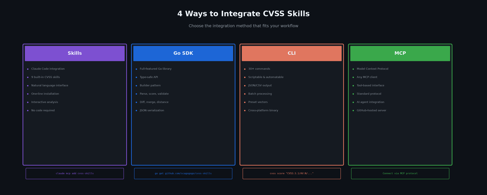
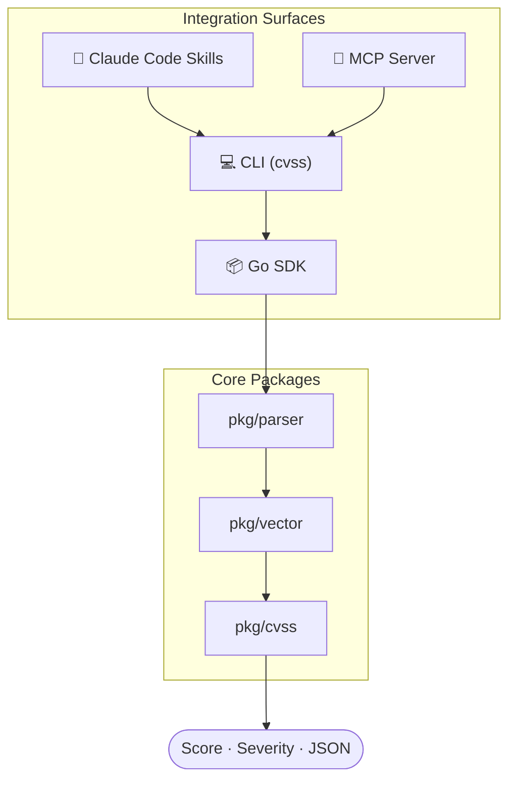
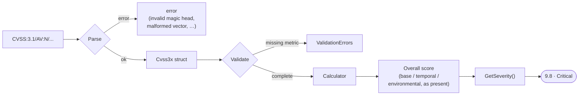
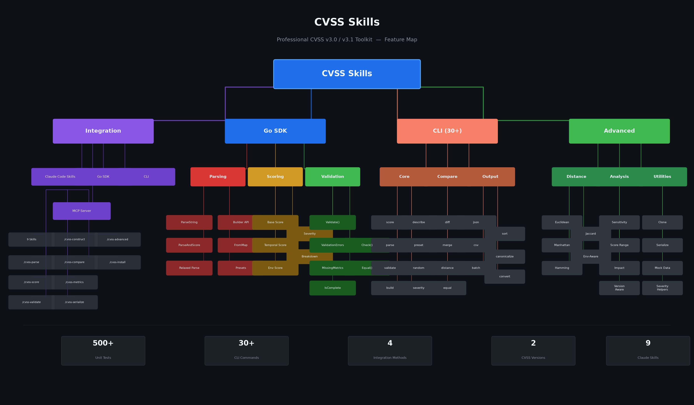
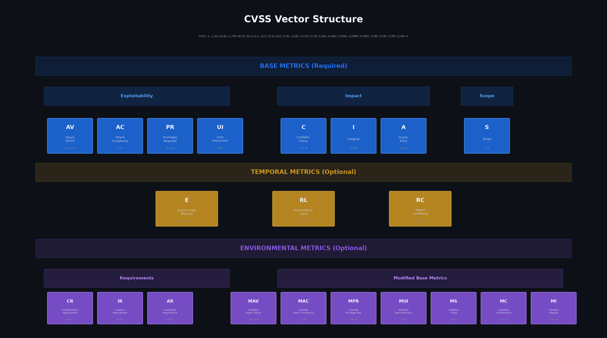
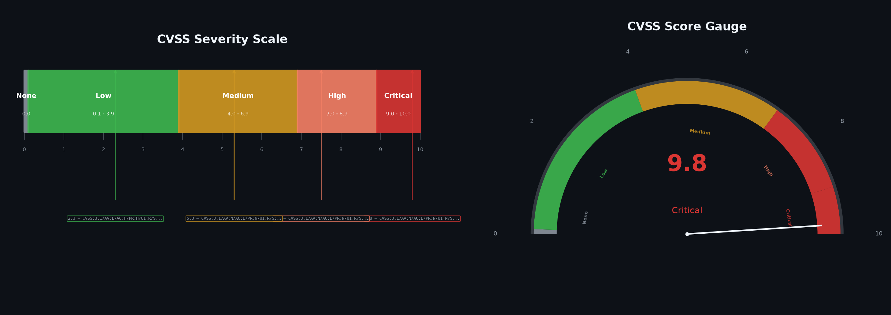
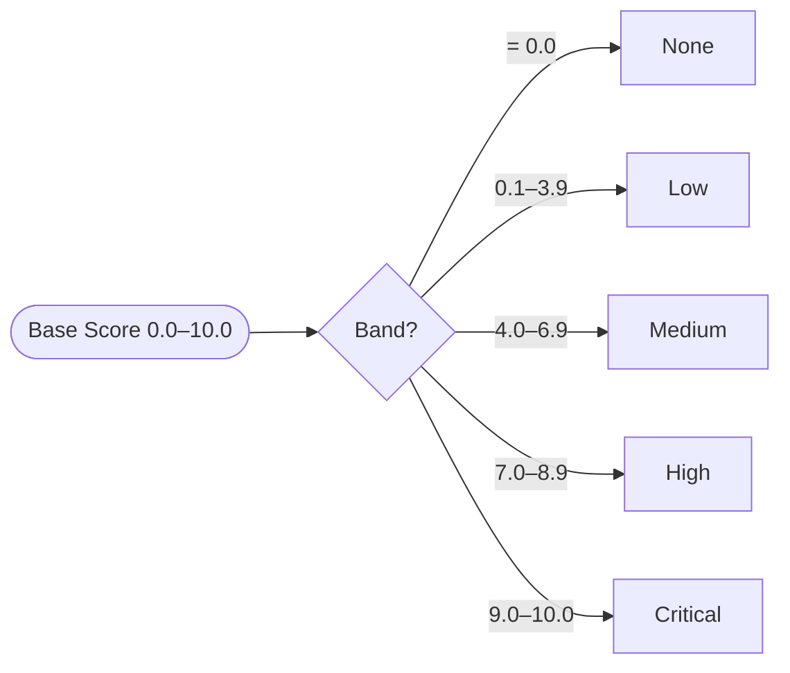

<div align="center">

# CVSS Skills

**Professional CVSS v3.0 / v3.1 Toolkit — Parse, Score, Validate, Compare & Build Vulnerability Vectors**

[](https://github.com/scagogogo/cvss-skills/actions/workflows/ci.yml)
[](https://github.com/scagogogo/cvss-skills/actions/workflows/release.yml)
[](https://goreportcard.com/report/github.com/scagogogo/cvss-skills)
[](https://opensource.org/licenses/MIT)
[](https://github.com/scagogogo/cvss-skills/releases/latest)

**Languages**: English | [简体中文](README_zh.md)

</div>

> **For AI agents**: This README is structured for machine consumption. Jump to [Integration Methods](#-integration-methods) for install commands, [CLI Commands](#-cli-commands) for the command surface, and [Pre-built Binaries](#-pre-built-binaries) for exact download URLs per OS/arch. The website at <https://scagogogo.github.io/cvss-skills/> mirrors this content.

---

## 🤖 Overview

**CVSS Skills** is a single, well-tested toolkit for the Common Vulnerability Scoring System (CVSS) v3.0 / v3.1. It solves the painful parts of working with CVSS vectors programmatically: error-prone parsing, version-specific scoring formulas, manual comparison, and scattered validation.

It is delivered through **4 integration methods**:

| | Integration | Best For | Install |
|---|---|---|---|
| 🤖 | **Skills** (Claude Code) | Interactive analysis, natural language | `claude mcp add --scope user cvss-skills -- https://github.com/scagogogo/cvss-skills` |
| 📦 | **Go SDK** | Building security tools in Go | `go get github.com/scagogogo/cvss-skills@latest` |
| 💻 | **CLI** | Scripting, batch processing | see [Pre-built Binaries](#-pre-built-binaries) |
| 🔌 | **MCP** | AI agent integration | add this repo as an MCP server |



**Repository facts**

| | |
|---|---|
| Module path | `github.com/scagogogo/cvss-skills` |
| Language | Go (≥ 1.18) |
| License | MIT |
| CLI binary name | `cvss` |
| CLI entry point | `cmd/cvss-cli/` |
| Release artifacts | 30+ packages (6 OS × multi-arch) via [GoReleaser](.goreleaser.yml) |
| Latest release | [](https://github.com/scagogogo/cvss-skills/releases/latest) |
| Website | <https://scagogogo.github.io/cvss-skills/> |

---

## 🏛️ Architecture

Every integration surface is a thin layer over the same well-tested Go core — nothing re-implements scoring:



The canonical pipeline — from a raw vector string to a score and severity:



## ✨ Feature Map



| Category | Features |
|----------|----------|
| **Parsing** | Parse v3.0/v3.1 vectors, relaxed parsing (no `CVSS:` prefix), `ParseAndScore` one-liner, Builder API, `FromMap` |
| **Scoring** | Base / Temporal / Environmental scores, severity ratings, per-metric score breakdown |
| **Validation** | Structural validation, `ValidationErrors` with per-metric reporting, `IsComplete()`, `MissingMetrics()` |
| **Comparison** | Diff (per-metric comparison), Merge, Equal / SameSeverity checks |
| **Distance** | Euclidean, Manhattan, Hamming, Jaccard similarity — with environment-aware variants |
| **Serialization** | JSON marshal/unmarshal, text marshal/unmarshal, CSV I/O, batch processing |
| **Advanced** | Sensitivity analysis, score range for partial vectors, version-aware scoring, presets, mock data generators |

---

## 🚀 Quick Start

### 1. Skills (Claude Code) — One Command

```bash
claude mcp add --scope user cvss-skills -- https://github.com/scagogogo/cvss-skills
```

This enables **9 CVSS skills** inside Claude Code — each a markdown instruction file under `.claude/skills/` that tells Claude which `cvss` CLI command to run: `cvss-parse`, `cvss-score`, `cvss-validate`, `cvss-construct`, `cvss-compare`, `cvss-metrics`, `cvss-serialize`, `cvss-advanced`, `cvss-install`. Ask in natural language ("score this vector: …") and Claude picks the right skill automatically.

<details>
<summary>Manual installation</summary>

Add to your project's `.claude/settings.json` or `~/.claude/settings.json`:

```json
{
  "mcpServers": {
    "cvss-skills": {
      "type": "github",
      "url": "https://github.com/scagogogo/cvss-skills"
    }
  }
}
```

</details>

### 2. Go SDK — Full-Featured Library

```bash
go get github.com/scagogogo/cvss-skills@latest
```

```go
package main

import (
    "fmt"
    "log"

    "github.com/scagogogo/cvss-skills/pkg/cvss"
    "github.com/scagogogo/cvss-skills/pkg/parser"
)

func main() {
    // One-step parse and score
    cv, score, severity, err := parser.ParseAndScore(
        "CVSS:3.1/AV:N/AC:L/PR:N/UI:N/S:U/C:H/I:H/A:H",
    )
    if err != nil {
        log.Fatal(err)
    }
    fmt.Printf("Score: %.1f (%s)\n", score, severity) // Score: 9.8 (Critical)
    _ = cv
}
```

### 3. CLI — Pre-built Binary or `go install`

```bash
# Install a pre-built binary (auto-detects OS/arch, resolves latest version)
os=$(uname -s | tr '[:upper:]' '[:lower:]'); arch=$(uname -m)
case "$arch" in arm64) arch=aarch64 ;; amd64) arch=x86_64 ;; esac
ver=$(curl -sL https://api.github.com/repos/scagogogo/cvss-skills/releases/latest | sed -nE 's/.*"tag_name":\s*"v?([^"]+)".*/\1/p')
curl -sL "https://github.com/scagogogo/cvss-skills/releases/download/v${ver}/cvss-skills_${ver}_${os}_${arch}.tar.gz" | tar xz
sudo mv cvss /usr/local/bin/

# Or install with Go
go install github.com/scagogogo/cvss-skills/cmd/cvss-cli@latest

# Use
cvss score "CVSS:3.1/AV:N/AC:L/PR:N/UI:N/S:U/C:H/I:H/A:H"
# Output: 9.8 (Critical)
```

### 4. MCP — AI Agent Integration

Connect this repository as an MCP server from any MCP-compatible client to use CVSS tools through the standard Model Context Protocol.

---

## 📦 Pre-built Binaries

Every [release](https://github.com/scagogogo/cvss-skills/releases/latest) ships **30+ packages** built by GoReleaser via GitHub Actions. Archive naming:

```
cvss-skills_<version>_<os>_<arch>[v<arm>].<tar.gz|zip>
```

**URL template** (replace `<version>`, e.g. `0.1.0`):

```
https://github.com/scagogogo/cvss-skills/releases/download/v<version>/cvss-skills_<version>_<os>_<arch>.<ext>
```

| OS | Architectures |
|---|---|
| **linux** | `x86_64`, `aarch64`, `i386`, `armv5`, `armv6`, `armv7`, `ppc64le`, `s390x`, `riscv64`, `mips64le` |
| **darwin** | `x86_64`, `aarch64` |
| **windows** | `x86_64`, `aarch64`, `i386` (`.zip`) |
| **freebsd** | `x86_64`, `aarch64`, `i386`, `armv5`, `armv6`, `armv7` |
| **netbsd** | `x86_64`, `aarch64`, `i386`, `armv5`, `armv6`, `armv7` |
| **openbsd** | `x86_64`, `aarch64`, `i386`, `armv5`, `armv6`, `armv7` |

Each release also ships `checksums.txt` (SHA256). Full matrix and verification steps: see the [Downloads page](https://scagogogo.github.io/cvss-skills/downloads/).

<details>
<summary>Build from source</summary>

```bash
git clone https://github.com/scagogogo/cvss-skills.git
cd cvss-skills
go build -o cvss ./cmd/cvss-cli/
# or: make build
```

</details>

---

## 🧮 CVSS Vector Structure



A CVSS vector consists of up to **3 layers** of metrics:

| Layer | Metrics | Required |
|-------|---------|----------|
| **Base** | AV, AC, PR, UI, S, C, I, A | Yes (all 8) |
| **Temporal** | E, RL, RC | No |
| **Environmental** | CR, IR, AR, MAV, MAC, MPR, MUI, MS, MC, MI, MA | No |

---

## 🎚️ Severity Scale



| Rating | Score Range | Color |
|--------|------------|-------|
| None | 0.0 | Gray |
| Low | 0.1 – 3.9 | Green |
| Medium | 4.0 – 6.9 | Yellow |
| High | 7.0 – 8.9 | Orange |
| Critical | 9.0 – 10.0 | Red |



---

## 📚 Go SDK Examples

### Parse and Calculate

```go
cvssVector, err := parser.ParseString("CVSS:3.1/AV:N/AC:L/PR:N/UI:N/S:U/C:H/I:H/A:H")
if err != nil {
    log.Fatalf("Parse failed: %v", err)
}

calculator := cvss.NewCalculator(cvssVector)
score, _ := calculator.Calculate()
fmt.Printf("CVSS Score: %.1f\n", score)              // 9.8
fmt.Printf("Severity: %s\n", cvss.GetSeverity(score)) // Critical
```

### Builder API

```go
cv := cvss.NewBuilder().Version(3, 1).
    AV('N').AC('L').PR('N').UI('N').S('U').
    C('H').I('H').A('H').MustBuild()

score, _ := cvss.NewCalculator(cv).Calculate()
fmt.Printf("Score: %.1f\n", score) // 9.8
```

### Structured Validation

```go
err := cv.Validate()
if ve, ok := err.(cvss.ValidationErrors); ok {
    fmt.Printf("Missing: %v\n", ve.MissingMetrics())
}
```

### Diff and Merge

```go
diffs := cv1.Diff(cv2)
for _, d := range diffs {
    fmt.Printf("%s: %s vs %s\n", d.Metric, d.V1, d.V2)
}

merged := cv1.Merge(cv2WithTemporal)
```

### Distance Calculation

```go
dc := cvss.NewDistanceCalculator(cv1, cv2)
fmt.Printf("Euclidean: %.2f\n", dc.EuclideanDistance())
fmt.Printf("Manhattan: %.2f\n", dc.ManhattanDistance())
fmt.Printf("Jaccard: %.2f\n", dc.JaccardSimilarity())
```

### Score Breakdown

```go
calc := cvss.NewCalculator(cv)
breakdown, _ := calc.GetScoreBreakdown()
for _, m := range breakdown.AllMetrics() {
    fmt.Printf("%s:%s = %.2f\n", m.ShortName, m.Value, m.Score)
}
```

### Convenience Methods

```go
cv.IsComplete()         // true if all 8 base metrics set
cv.Is31()               // true if CVSS v3.1
cv.HasTemporalMetrics() // true if temporal metrics present
cv.HasEnvironmentalMetrics() // true if environmental metrics present
cv.MissingMetrics()     // list of missing metric names
cv.Clone()              // deep copy
cv.BaseOnly()           // clone without temporal/environmental
cv.Equal(other)         // exact metric comparison
cv.EqualScore(other)    // score-based comparison
cv.SameSeverity(other)  // severity-based comparison
```

---

## 💻 CLI Commands

30+ commands. All support `--format json` for structured output. Run `cvss --help` for the full list.

| Command | Description | Example |
|---------|-------------|---------|
| `cvss score` | Calculate CVSS scores | `cvss score "CVSS:3.1/AV:N/AC:L/PR:N/UI:N/S:U/C:H/I:H/A:H"` |
| `cvss parse` | Parse a vector string | `cvss parse "CVSS:3.1/AV:N/AC:L/PR:N/UI:N/S:U/C:H/I:H/A:H"` |
| `cvss validate` | Validate a vector string | `cvss validate "CVSS:3.1/AV:N/AC:L/PR:N/UI:N/S:U/C:H/I:H/A:H"` |
| `cvss build` | Build from metric flags | `cvss build --AV N --AC L --PR N --UI N --S U --C H --I H --A H` |
| `cvss describe` | Human-readable description | `cvss describe "CVSS:3.1/AV:N/AC:L/PR:N/UI:N/S:U/C:H/I:H/A:H"` |
| `cvss diff` | Compare two vectors | `cvss diff "CVSS:3.1/..." "CVSS:3.1/..."` |
| `cvss merge` | Merge two vectors | `cvss merge "CVSS:3.1/..." "CVSS:3.1/..."` |
| `cvss distance` | Calculate distance metrics | `cvss distance "CVSS:3.1/..." "CVSS:3.1/..."` |
| `cvss analyze` | Impact/sensitivity analysis | `cvss analyze "CVSS:3.1/..."` |
| `cvss range` | Score range for partial vectors | `cvss range "CVSS:3.1/AV:N"` |
| `cvss preset` | Generate preset vectors | `cvss preset critical` |
| `cvss random` | Generate random vectors | `cvss random --cvss-version 3.1` |
| `cvss json` | JSON serialization | `cvss json "CVSS:3.1/..."` |
| `cvss csv` | CSV read/write (subcommands) | `cvss csv read input.csv` |
| `cvss batch` | Batch score/validate (subcommands) | `cvss batch score vectors.txt` |
| `cvss severity` | Severity rating from a score | `cvss severity 9.8` |
| `cvss sort` | Sort vectors by score | `cvss sort file.csv` |
| `cvss canonicalize` | Canonicalize vector format | `cvss canonicalize "CVSS:3.1/..."` |
| `cvss convert` | Convert between versions | `cvss convert "CVSS:3.0/..." --to 3.1` |
| `cvss enumerate` | List a metric's valid values | `cvss enumerate --metric AV` |
| `cvss equal` | Compare two vectors | `cvss equal "CVSS:3.1/..." "CVSS:3.1/..."` |
| `cvss get` | Get one metric's value | `cvss get "CVSS:3.1/..." AV` |
| `cvss groups` | Show metrics by group | `cvss groups "CVSS:3.1/..."` |
| `cvss map` | Output vector as key=value | `cvss map "CVSS:3.1/..."` |
| `cvss modify` | Modify metrics (via flags) | `cvss modify "CVSS:3.1/..." --AV L` |
| `cvss base-only` | Strip temporal/env metrics (`strip` alias) | `cvss base-only "CVSS:3.1/..."` |
| `cvss subs` | Show Impact/Exploitability sub-scores | `cvss subs "CVSS:3.1/..."` |

---

## 📖 Documentation

Website: **<https://scagogogo.github.io/cvss-skills/>**

- [Integration Methods](https://scagogogo.github.io/cvss-skills/integration/) — compare the 4 ways to use CVSS Skills
- [CLI Reference](https://scagogogo.github.io/cvss-skills/cli/) — all 30+ commands
- [Downloads](https://scagogogo.github.io/cvss-skills/downloads/) — pre-built binary matrix
- [API Reference](https://scagogogo.github.io/cvss-skills/docs/api/) — complete Go SDK API docs
- [Examples & Tutorials](https://scagogogo.github.io/cvss-skills/docs/examples/) — practical usage
- [Quick Start Guide](https://scagogogo.github.io/cvss-skills/docs/api/getting-started) — get started in 5 minutes
- [Chinese Documentation](https://scagogogo.github.io/cvss-skills/zh/) — 简体中文

---

## 🤝 Contributing

We welcome contributions, issue reports, and suggestions!

- [GitHub Issues](https://github.com/scagogogo/cvss-skills/issues) — report issues or suggestions
- [Contributing Guide](https://scagogogo.github.io/cvss-skills/docs/CONTRIBUTING) — how to contribute code

## License

MIT License — see the [LICENSE](LICENSE) file for details.

## Acknowledgments

- [CVSS v3.1 Specification](https://www.first.org/cvss/v3.1/specification-document)
- [CVSS v3.0 Specification](https://www.first.org/cvss/v3.0/specification-document)
