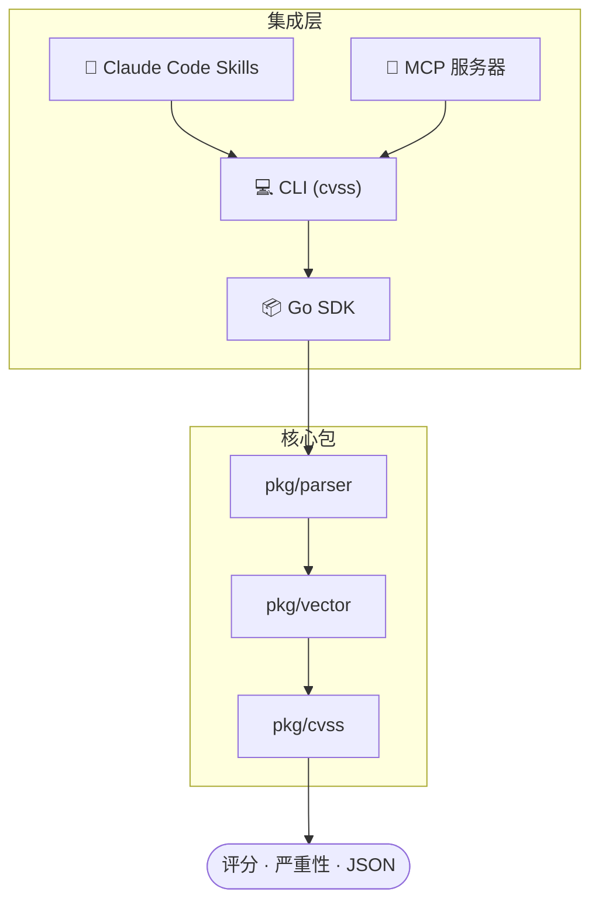
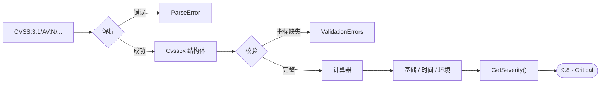
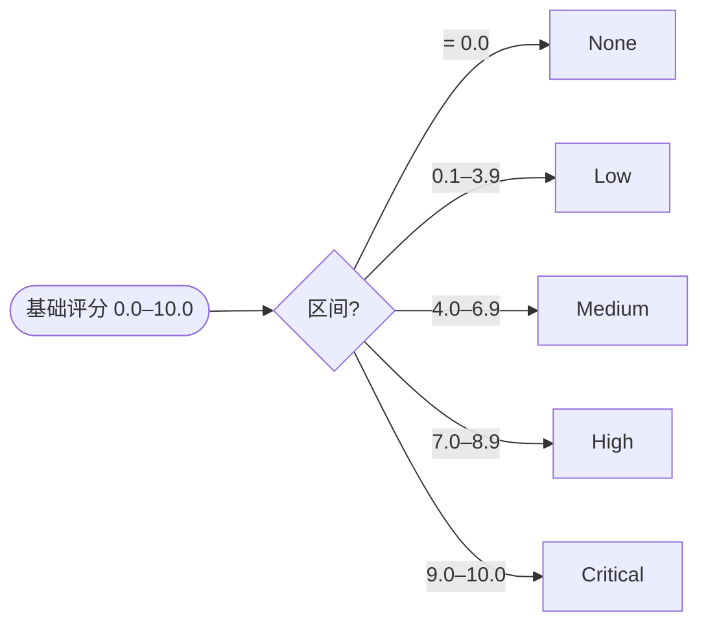

<div align="center">

# CVSS Skills

**专业 CVSS v3.0 / v3.1 工具包 — 解析、评分、验证、比较与构建漏洞向量**

[](https://github.com/scagogogo/cvss-skills/actions/workflows/ci.yml)
[](https://github.com/scagogogo/cvss-skills/actions/workflows/release.yml)
[](https://goreportcard.com/report/github.com/scagogogo/cvss-skills)
[](https://opensource.org/licenses/MIT)
[](https://github.com/scagogogo/cvss-skills/releases/latest)

**语言**: [English](README.md) | 简体中文

</div>

> **面向 AI 智能体**：本 README 按机器可读方式组织。安装命令见[集成方式](#集成方式)，命令清单见 [CLI 命令](#-cli-命令)，各系统/架构的精确下载 URL 见[预编译二进制](#-预编译二进制)。官网 <https://scagogogo.github.io/cvss-skills/> 内容同步。

---

## 🤖 概述

CVSS（通用漏洞评分系统）是业界标准的漏洞严重性评级体系，但以编程方式处理 CVSS 向量却十分痛苦：

- **解析容易出错** — 像 `CVSS:3.1/AV:N/AC:L/PR:N/UI:N/S:U/C:H/I:H/A:H` 这样的向量字符串，需要仔细处理版本号、指标和值
- **评分逻辑复杂** — 基础、时间和环境评分涉及不同的公式，还有版本差异（如 v3.0 中 `UI:R`=0.56，v3.1 中 `UI:R`=0.62）
- **比较依赖手工** — 向量之间的差异对比、合并和距离度量需要理解所有指标的交互关系
- **验证零散低效** — 检查完整性、查找缺失指标、逐指标报告错误，流程繁琐
- **缺乏统一工具** — 安全团队不得不同时使用电子表格、网页计算器和自定义脚本

**CVSS Skills** 通过一个经过充分测试的工具包解决了上述所有问题，并提供 **4 种接入方式**：

| | 接入方式 | 适用场景 | 安装 |
|---|---|---|---|
| 🤖 | **Skills**（Claude Code） | 交互式分析、自然语言查询 | `claude mcp add --scope user cvss-skills -- https://github.com/scagogogo/cvss-skills` |
| 📦 | **Go SDK** | Go 语言安全工具开发与自动化 | `go get github.com/scagogogo/cvss-skills@latest` |
| 💻 | **CLI** | 脚本化、批量处理、快速查询 | 见[预编译二进制](#-预编译二进制) |
| 🔌 | **MCP** | 通过模型上下文协议集成 AI 智能体 | 将本仓库添加为 MCP 服务器 |


**仓库信息**

| | |
|---|---|
| 模块路径 | `github.com/scagogogo/cvss-skills` |
| 语言 | Go（≥ 1.18） |
| 许可证 | MIT |
| CLI 二进制名 | `cvss` |
| CLI 入口 | `cmd/cvss-cli/` |
| 发布产物 | 30+ 个包（6 系统 × 多架构），经 [GoReleaser](.goreleaser.yml) 构建 |
| 最新版本 | [](https://github.com/scagogogo/cvss-skills/releases/latest) |
| 官网 | <https://scagogogo.github.io/cvss-skills/> |

---

## 🏛️ 架构

每个集成层都是同一套经过充分测试的 Go 核心之上的薄封装 —— 评分逻辑没有任何重复实现：



标准流水线 —— 从原始向量字符串到评分与严重性：



## ✨ 功能全景图


### 核心能力

| 类别 | 功能 |
|------|------|
| **解析** | 解析 v3.0/v3.1 向量、宽松解析（无需 `CVSS:` 前缀）、`ParseAndScore` 一步到位、Builder API、`FromMap` |
| **评分** | 基础 / 时间 / 环境评分、严重性评级、逐指标评分分解 |
| **验证** | 结构化验证、`ValidationErrors` 逐指标报错、`IsComplete()`、`MissingMetrics()` |
| **比较** | Diff（逐指标对比）、Merge、Equal / SameSeverity 判等 |
| **距离** | 欧氏距离、曼哈顿距离、汉明距离、Jaccard 相似度 — 含环境感知变体 |
| **序列化** | JSON 序列化/反序列化、文本序列化/反序列化、CSV 读写、批量处理 |
| **高级** | 敏感度分析、部分向量评分范围、版本感知评分、预设向量、Mock 数据生成器 |

---

## 🚀 快速开始

### 1. Skills（Claude Code）— 一行命令

```bash
claude mcp add --scope user cvss-skills -- https://github.com/scagogogo/cvss-skills
```

启用 **9 个 CVSS 技能**：

| 技能 | 说明 |
|------|------|
| `/cvss-parse` | 解析 CVSS v3.0/v3.1 向量字符串 |
| `/cvss-score` | 计算基础/时间/环境评分 |
| `/cvss-validate` | 验证向量完整性和正确性 |
| `/cvss-construct` | 使用 Builder API 构建向量 |
| `/cvss-compare` | 差异对比、合并和距离计算 |
| `/cvss-metrics` | 枚举和查看指标定义 |
| `/cvss-serialize` | JSON/文本序列化与反序列化 |
| `/cvss-advanced` | 敏感度分析、评分范围、预设向量 |
| `/cvss-install` | 安装 CLI 工具和 Go SDK 依赖 |

<details>
<summary>手动安装</summary>

添加到项目的 `.claude/settings.json` 或 `~/.claude/settings.json`：

```json
{
  "mcpServers": {
    "cvss-skills": {
      "type": "github",
      "url": "https://github.com/scagogogo/cvss-skills"
    }
  }
}
```

</details>

### 2. Go SDK — 功能完整的库

```bash
go get github.com/scagogogo/cvss-skills@latest
```

```go
package main

import (
    "fmt"
    "log"

    "github.com/scagogogo/cvss-skills/pkg/cvss"
    "github.com/scagogogo/cvss-skills/pkg/parser"
)

func main() {
    // 一步解析并评分
    cv, score, severity, err := parser.ParseAndScore(
        "CVSS:3.1/AV:N/AC:L/PR:N/UI:N/S:U/C:H/I:H/A:H",
    )
    if err != nil {
        log.Fatal(err)
    }
    fmt.Printf("评分: %.1f (%s)\n", score, severity) // 评分: 9.8 (Critical)
    _ = cv
}
```

### 3. CLI — 30+ 命令

```bash
# 从 GitHub Release 安装（自动识别系统/架构）
os=$(uname -s | tr '[:upper:]' '[:lower:]'); arch=$(uname -m)
case "$arch" in arm64) arch=aarch64 ;; amd64) arch=x86_64 ;; esac
curl -sL "https://github.com/scagogogo/cvss-skills/releases/latest/download/cvss-skills_${os}_${arch}.tar.gz" | tar xz
sudo mv cvss /usr/local/bin/

# 或使用 Go 安装
go install github.com/scagogogo/cvss-skills/cmd/cvss-cli@latest

# 使用
cvss score "CVSS:3.1/AV:N/AC:L/PR:N/UI:N/S:U/C:H/I:H/A:H"
# 输出: 9.8 (Critical)
```

### 4. MCP — AI 智能体集成

从任何兼容 MCP 的客户端连接此仓库作为 MCP 服务器，即可通过标准模型上下文协议使用 CVSS 工具。

---

## 📦 预编译二进制

每次 [发布](https://github.com/scagogogo/cvss-skills/releases/latest) 附带 **30+ 个包**，由 GoReleaser 经 GitHub Actions 构建。归档命名：

```
cvss-skills_<版本>_<系统>_<架构>[v<arm>].<tar.gz|zip>
```

**URL 模板**（用 `latest` 或标签如 `0.1.0`）：

```
https://github.com/scagogogo/cvss-skills/releases/latest/download/cvss-skills_<系统>_<架构>.<扩展名>
```

| 系统 | 架构 |
|---|---|
| **linux** | `x86_64`, `aarch64`, `i386`, `armv5`, `armv6`, `armv7`, `ppc64le`, `s390x`, `riscv64`, `mips64le` |
| **darwin** | `x86_64`, `aarch64` |
| **windows** | `x86_64`, `aarch64`, `i386`（`.zip`） |
| **freebsd** | `x86_64`, `aarch64`, `i386`, `armv5`, `armv6`, `armv7` |
| **netbsd** | `x86_64`, `aarch64`, `i386`, `armv5`, `armv6`, `armv7` |
| **openbsd** | `x86_64`, `aarch64`, `i386`, `armv5`, `armv6`, `armv7` |

每次发布还附带 `checksums.txt`（SHA256）。完整矩阵与校验步骤见[下载页](https://scagogogo.github.io/cvss-skills/zh/downloads/)。

<details>
<summary>从源码构建</summary>

```bash
git clone https://github.com/scagogogo/cvss-skills.git
cd cvss-skills
go build -o cvss ./cmd/cvss-cli/
# 或: make build
```

</details>

---

## 🧮 CVSS 向量结构


CVSS 向量由最多 **3 层**指标组成：

| 层级 | 指标 | 是否必需 |
|------|------|----------|
| **基础** | AV, AC, PR, UI, S, C, I, A | 是（全部 8 个） |
| **时间** | E, RL, RC | 否 |
| **环境** | CR, IR, AR, MAV, MAC, MPR, MUI, MS, MC, MI, MA | 否 |

---

## 🎚️ 严重性等级


| 等级 | 分数范围 | 颜色 |
|------|---------|------|
| 无 | 0.0 | 灰色 |
| 低 | 0.1 – 3.9 | 绿色 |
| 中 | 4.0 – 6.9 | 黄色 |
| 高 | 7.0 – 8.9 | 橙色 |
| 严重 | 9.0 – 10.0 | 红色 |



---

## 📚 Go SDK 示例

### 解析和计算

```go
cvssVector, err := parser.ParseString("CVSS:3.1/AV:N/AC:L/PR:N/UI:N/S:U/C:H/I:H/A:H")
if err != nil {
    log.Fatalf("解析失败: %v", err)
}

calculator := cvss.NewCalculator(cvssVector)
score, _ := calculator.Calculate()
fmt.Printf("CVSS 评分: %.1f\n", score)               // 9.8
fmt.Printf("严重性: %s\n", cvss.GetSeverity(score))    // Critical
```

### Builder API

```go
cv := cvss.NewBuilder().Version(3, 1).
    AV('N').AC('L').PR('N').UI('N').S('U').
    C('H').I('H').A('H').MustBuild()

score, _ := cvss.NewCalculator(cv).Calculate()
fmt.Printf("评分: %.1f\n", score) // 9.8
```

### 结构化验证

```go
err := cv.Validate()
if ve, ok := err.(cvss.ValidationErrors); ok {
    fmt.Printf("缺失指标: %v\n", ve.MissingMetrics())
}
```

### 差异和合并

```go
diffs := cv1.Diff(cv2)
for _, d := range diffs {
    fmt.Printf("%s: %s vs %s\n", d.Metric, d.V1, d.V2)
}

merged := cv1.Merge(cv2WithTemporal)
```

### 距离计算

```go
dc := cvss.NewDistanceCalculator(cv1, cv2)
fmt.Printf("欧氏距离: %.2f\n", dc.EuclideanDistance())
fmt.Printf("曼哈顿距离: %.2f\n", dc.ManhattanDistance())
fmt.Printf("Jaccard 相似度: %.2f\n", dc.JaccardSimilarity())
```

### 评分分解

```go
calc := cvss.NewCalculator(cv)
breakdown, _ := calc.GetScoreBreakdown()
for _, m := range breakdown.AllMetrics() {
    fmt.Printf("%s:%s = %.2f\n", m.ShortName, m.Value, m.Score)
}
```

### 便捷方法

```go
cv.IsComplete()              // 全部 8 个基础指标都已设置
cv.Is31()                    // 是否为 CVSS v3.1
cv.HasTemporalMetrics()      // 是否有时间指标
cv.HasEnvironmentalMetrics() // 是否有环境指标
cv.MissingMetrics()          // 缺失的指标名列表
cv.Clone()                   // 深拷贝
cv.BaseOnly()                // 仅保留基础指标的克隆
cv.Equal(other)              // 精确指标比较
cv.EqualScore(other)         // 基于评分的比较
cv.SameSeverity(other)       // 基于严重性等级的比较
```

---

## 💻 CLI 命令

| 命令 | 说明 | 示例 |
|------|------|------|
| `cvss score` | 计算 CVSS 评分 | `cvss score "CVSS:3.1/AV:N/AC:L/PR:N/UI:N/S:U/C:H/I:H/A:H"` |
| `cvss parse` | 解析向量字符串 | `cvss parse "CVSS:3.1/AV:N/AC:L/PR:N/UI:N/S:U/C:H/I:H/A:H"` |
| `cvss validate` | 验证向量字符串 | `cvss validate "CVSS:3.1/AV:N/AC:L/PR:N/UI:N/S:U/C:H/I:H/A:H"` |
| `cvss build` | 通过指标标志构建向量 | `cvss build --av N --ac L --pr N --ui N --s U --c H --i H --a H` |
| `cvss describe` | 人类可读的描述 | `cvss describe "CVSS:3.1/..."` |
| `cvss diff` | 比较两个向量 | `cvss diff "CVSS:3.1/..." "CVSS:3.1/..."` |
| `cvss merge` | 合并两个向量 | `cvss merge "CVSS:3.1/..." "CVSS:3.1/..."` |
| `cvss distance` | 计算距离度量 | `cvss distance "CVSS:3.1/..." "CVSS:3.1/..."` |
| `cvss analyze` | 影响/敏感度分析 | `cvss analyze "CVSS:3.1/..."` |
| `cvss range` | 部分向量的评分范围 | `cvss range "CVSS:3.1/AV:N"` |
| `cvss preset` | 生成预设向量 | `cvss preset critical-network` |
| `cvss random` | 生成随机向量 | `cvss random --version 3.1` |
| `cvss json` | JSON 序列化 | `cvss json "CVSS:3.1/..."` |
| `cvss csv` | CSV 文件读写 | `cvss csv input.csv --output results.csv` |
| `cvss batch` | 批量操作 | `cvss batch --file vectors.txt` |
| `cvss severity` | 获取严重性评级 | `cvss severity "CVSS:3.1/..."` |
| `cvss sort` | 按评分排序向量 | `cvss sort file.csv` |
| `cvss canonicalize` | 规范化向量格式 | `cvss canonicalize "CVSS:3.1/..."` |
| `cvss convert` | 版本转换 | `cvss convert "CVSS:3.0/..." --to 3.1` |
| `cvss enumerate` | 枚举指标值 | `cvss enumerate AV` |
| `cvss equal` | 比较两个向量 | `cvss equal "CVSS:3.1/..." "CVSS:3.1/..."` |
| `cvss get` | 获取指定指标值 | `cvss get AV "CVSS:3.1/..."` |
| `cvss groups` | 显示指标分组 | `cvss groups` |
| `cvss map` | 映射/变换向量 | `cvss map --preset high-severity` |
| `cvss modify` | 修改指标值 | `cvss modify AV L "CVSS:3.1/..."` |
| `cvss strip` | 移除时间/环境指标 | `cvss strip "CVSS:3.1/..."` |
| `cvss subs` | 显示指标替代关系 | `cvss subs` |

所有命令均支持 `--format json` 输出结构化数据。运行 `cvss --help` 查看完整列表。

---

## 📖 文档

官网：**<https://scagogogo.github.io/cvss-skills/>**

- [集成方式](https://scagogogo.github.io/cvss-skills/zh/integration/) — 对比 4 种使用 CVSS Skills 的方式
- [CLI 参考](https://scagogogo.github.io/cvss-skills/zh/cli/) — 全部 30+ 命令
- [下载](https://scagogogo.github.io/cvss-skills/zh/downloads/) — 预编译二进制矩阵
- [API 参考](https://scagogogo.github.io/cvss-skills/docs/zh/api/) — 完整的 Go SDK API 文档
- [示例和教程](https://scagogogo.github.io/cvss-skills/docs/zh/examples/) — 实用的使用示例
- [快速开始指南](https://scagogogo.github.io/cvss-skills/docs/zh/api/getting-started) — 5 分钟快速上手

---

## 🤝 贡献

欢迎贡献代码、报告问题和提出建议！

- [GitHub Issues](https://github.com/scagogogo/cvss-skills/issues) — 报告问题或建议
- [贡献指南](https://scagogogo.github.io/cvss-skills/docs/CONTRIBUTING) — 了解如何贡献代码

## 📄 许可证

MIT 许可证 — 详见 [LICENSE](LICENSE) 文件。

## 🙏 致谢

- [CVSS v3.1 规范](https://www.first.org/cvss/v3.1/specification-document)
- [CVSS v3.0 规范](https://www.first.org/cvss/v3.0/specification-document)
