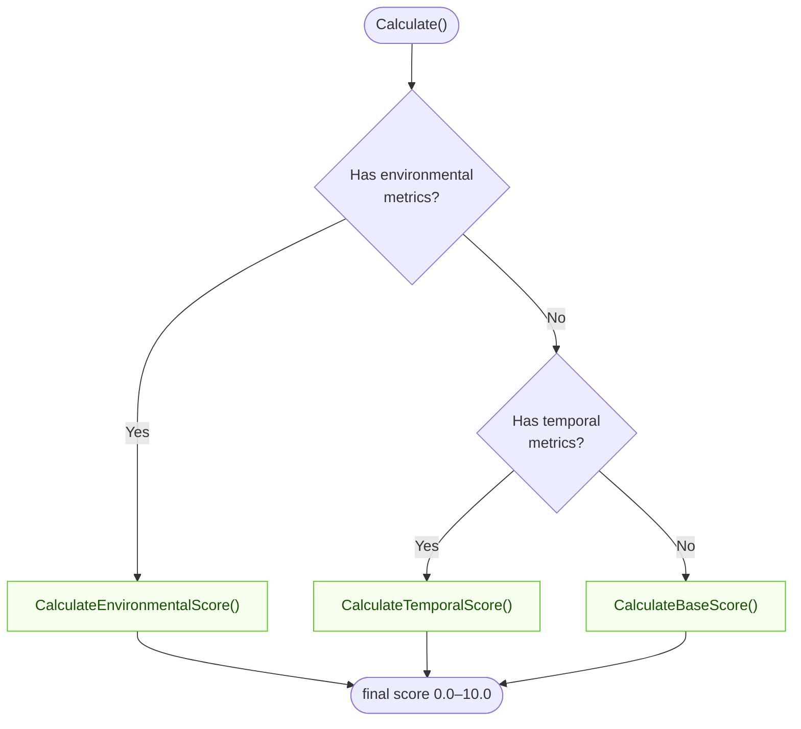
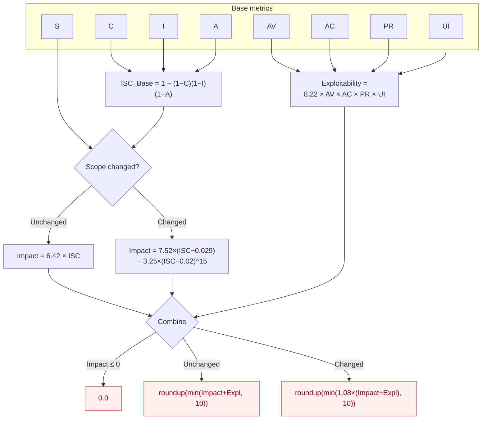

# Calculator

The `Calculator` is the core component in CVSS Skills for computing CVSS scores. It provides complete CVSS 3.x score calculation functionality, including base score, temporal score, and environmental score.

## How `Calculate()` Chooses a Score

`Calculate()` inspects which metric groups are present and returns the most specific score available — environmental > temporal > base:



## Base Score Formula (CVSS v3.1)

The base score is derived from two sub-scores — Impact and Exploitability — combined differently depending on whether Scope (`S`) changed:



::: tip Version-specific quirk
`PR` and `UI` value weights differ between v3.0 and v3.1 (e.g. `UI:R` = 0.56 in v3.0 vs 0.62 in v3.1). The Calculator is version-aware and applies the correct table automatically based on the parsed `CVSS:3.0` / `CVSS:3.1` prefix.
:::

## Interface Definition

```go
type Calculator interface {
    Calculate() (float64, error)
    CalculateBaseScore() (float64, error)
    CalculateTemporalScore() (float64, error)
    CalculateEnvironmentalScore() (float64, error)
    GetSeverityRating(score float64) string
}
```

## Creating Calculator

### NewCalculator

```go
func NewCalculator(vector *Cvss3x) Calculator
```

Creates a new calculator instance.

**Parameters:**
- `vector`: The CVSS 3.x vector to calculate

**Returns:**
- `Calculator`: Calculator instance

**Example:**
```go
calculator := cvss.NewCalculator(cvssVector)
```

## Main Methods

### Calculate

```go
func (c *Calculator) Calculate() (float64, error)
```

Calculates the final CVSS score. Automatically selects the appropriate calculation method based on the metrics included in the vector:
- Base metrics only: returns base score
- Includes temporal metrics: returns temporal score
- Includes environmental metrics: returns environmental score

**Returns:**
- `float64`: CVSS score (0.0-10.0)
- `error`: Calculation error

**Example:**
```go
score, err := calculator.Calculate()
if err != nil {
    log.Fatalf("Calculation failed: %v", err)
}
fmt.Printf("CVSS Score: %.1f\n", score)
```

### CalculateBaseScore

```go
func (c *Calculator) CalculateBaseScore() (float64, error)
```

Calculates the CVSS base score based only on base metrics.

**Calculation Formula:**
```
If (Impact <= 0)
    BaseScore = 0
Else
    If (Scope == Unchanged)
        BaseScore = Roundup(Minimum((Impact + Exploitability), 10))
    Else
        BaseScore = Roundup(Minimum(1.08 × (Impact + Exploitability), 10))
```

**Example:**
```go
baseScore, err := calculator.CalculateBaseScore()
if err != nil {
    log.Fatalf("Base score calculation failed: %v", err)
}
fmt.Printf("Base Score: %.1f\n", baseScore)
```

### GetSeverityRating

```go
func (c *Calculator) GetSeverityRating(score float64) string
```

Gets the corresponding severity level based on CVSS score.

**Score Ranges and Levels:**

| Score Range | Severity Level |
|-------------|----------------|
| 0.0 | None |
| 0.1-3.9 | Low |
| 4.0-6.9 | Medium |
| 7.0-8.9 | High |
| 9.0-10.0 | Critical |

**Example:**
```go
score := 7.5
severity := calculator.GetSeverityRating(score)
fmt.Printf("Score %.1f corresponds to severity: %s\n", score, severity) // "High"
```

## Complete Example

### Basic Usage

```go
package main

import (
    "fmt"
    "log"

    "github.com/scagogogo/cvss-skills/pkg/cvss"
    "github.com/scagogogo/cvss-skills/pkg/parser"
)

func main() {
    // Parse CVSS vector
    vectorStr := "CVSS:3.1/AV:N/AC:L/PR:N/UI:N/S:U/C:H/I:H/A:H"
    p := parser.NewCvss3xParser(vectorStr)
    vector, err := p.Parse()
    if err != nil {
        log.Fatalf("Parse failed: %v", err)
    }

    // Create calculator
    calculator := cvss.NewCalculator(vector)

    // Calculate score
    score, err := calculator.Calculate()
    if err != nil {
        log.Fatalf("Calculation failed: %v", err)
    }

    severity := calculator.GetSeverityRating(score)

    // Output results
    fmt.Printf("CVSS Vector: %s\n", vectorStr)
    fmt.Printf("Score: %.1f\n", score)
    fmt.Printf("Severity: %s\n", severity)
}
```

## Error Handling

```go
score, err := calculator.Calculate()
if err != nil {
    switch e := err.(type) {
    case *cvss.InvalidVectorError:
        fmt.Printf("Invalid vector: %s\n", e.Message)
    case *cvss.CalculationError:
        fmt.Printf("Calculation error: %s\n", e.Message)
    default:
        fmt.Printf("Unknown error: %v\n", err)
    }
}
```

## Related Documentation

- [Cvss3x Data Structure](/api/cvss/cvss3x)
- [Usage Examples](/examples/basic)
- [CVSS Specification](https://www.first.org/cvss/v3.1/specification-document)