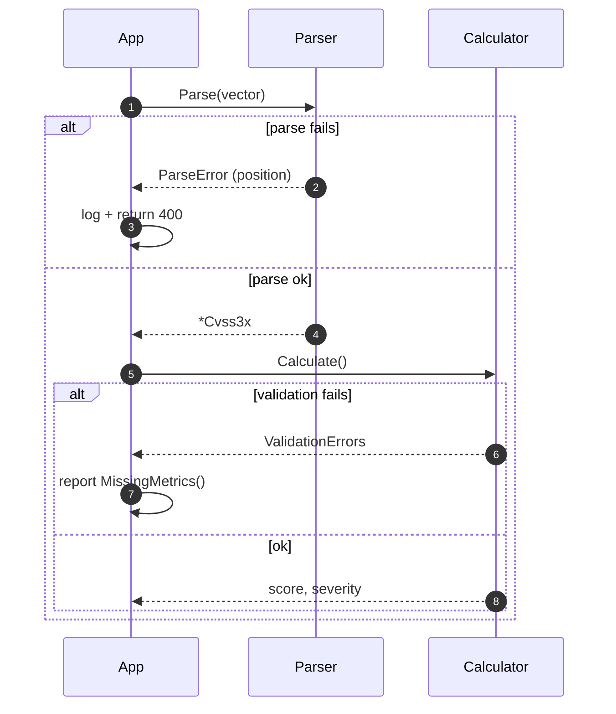

# Error Handling Guide

This guide covers comprehensive error handling patterns, error types, and best practices for robust CVSS Skills applications.

## Error Taxonomy

All errors implement the `CVSSError` interface and carry an `ErrorType`, so a single `switch` can route handling by category:

```mermaid
flowchart TD
    E["CVSSError (interface)"] --> T{Type()}
    T --> V["ErrorTypeValidation<br/>missing/illegal metric"]
    T --> P["ErrorTypeParsing<br/>malformed vector string"]
    T --> C["ErrorTypeCalculation<br/>score computation failed"]
    T --> Cfg["ErrorTypeConfiguration"]
    T --> N["ErrorTypeNetwork"]
    T --> To["ErrorTypeTimeout"]
    T --> I["ErrorTypeInternal"]

    V --> Act1["fix vector / report<br/>MissingMetrics()"]
    P --> Act2["show position + reason"]
    C --> Act3["retry / log & abort"]

    classDef err fill:#fff1f0,stroke:#ff4d4f,color:#a8071a;
    class V,P,C,Cfg,N,To,I err;
```

## Recommended Handling Flow



## Overview

CVSS Skills provides structured error handling with:

- Typed error interfaces
- Error categorization
- Recovery strategies
- Debugging information
- Logging integration

## Error Types

### Core Error Interfaces

```go
// CVSSError is the base interface for all CVSS-related errors
type CVSSError interface {
    error
    Code() string
    Type() ErrorType
    Details() map[string]interface{}
    Unwrap() error
}

// ErrorType categorizes different types of errors
type ErrorType int

const (
    ErrorTypeValidation ErrorType = iota
    ErrorTypeParsing
    ErrorTypeCalculation
    ErrorTypeConfiguration
    ErrorTypeNetwork
    ErrorTypeTimeout
    ErrorTypeInternal
)
```

### Validation Errors

```go
type ValidationError struct {
    Field   string `json:"field"`
    Value   string `json:"value"`
    Rule    string `json:"rule"`
    Message string `json:"message"`
    cause   error
}

func (e *ValidationError) Error() string {
    return fmt.Sprintf("validation failed for field '%s': %s", e.Field, e.Message)
}

func (e *ValidationError) Code() string {
    return "VALIDATION_ERROR"
}

func (e *ValidationError) Type() ErrorType {
    return ErrorTypeValidation
}

func (e *ValidationError) Details() map[string]interface{} {
    return map[string]interface{}{
        "field": e.Field,
        "value": e.Value,
        "rule":  e.Rule,
    }
}

func (e *ValidationError) Unwrap() error {
    return e.cause
}
```

### Parsing Errors

```go
type ParseError struct {
    Input    string `json:"input"`
    Position int    `json:"position"`
    Expected string `json:"expected"`
    Found    string `json:"found"`
    Message  string `json:"message"`
    cause    error
}

func (e *ParseError) Error() string {
    return fmt.Sprintf("parse error at position %d: %s", e.Position, e.Message)
}

func (e *ParseError) Code() string {
    return "PARSE_ERROR"
}

func (e *ParseError) Type() ErrorType {
    return ErrorTypeParsing
}

func (e *ParseError) Details() map[string]interface{} {
    return map[string]interface{}{
        "input":    e.Input,
        "position": e.Position,
        "expected": e.Expected,
        "found":    e.Found,
    }
}
```

### Calculation Errors

```go
type CalculationError struct {
    Vector  string `json:"vector"`
    Metric  string `json:"metric"`
    Value   string `json:"value"`
    Message string `json:"message"`
    cause   error
}

func (e *CalculationError) Error() string {
    return fmt.Sprintf("calculation error for metric '%s': %s", e.Metric, e.Message)
}

func (e *CalculationError) Code() string {
    return "CALCULATION_ERROR"
}

func (e *CalculationError) Type() ErrorType {
    return ErrorTypeCalculation
}
```

## Error Creation Functions

### Validation Errors

```go
func NewValidationError(field, value, rule, message string) *ValidationError {
    return &ValidationError{
        Field:   field,
        Value:   value,
        Rule:    rule,
        Message: message,
    }
}

func NewValidationErrorf(field, value, rule, format string, args ...interface{}) *ValidationError {
    return &ValidationError{
        Field:   field,
        Value:   value,
        Rule:    rule,
        Message: fmt.Sprintf(format, args...),
    }
}

func WrapValidationError(err error, field, value, rule string) *ValidationError {
    return &ValidationError{
        Field:   field,
        Value:   value,
        Rule:    rule,
        Message: err.Error(),
        cause:   err,
    }
}
```

### Parsing Errors

```go
func NewParseError(input string, position int, expected, found, message string) *ParseError {
    return &ParseError{
        Input:    input,
        Position: position,
        Expected: expected,
        Found:    found,
        Message:  message,
    }
}

func NewParseErrorf(input string, position int, expected, found, format string, args ...interface{}) *ParseError {
    return &ParseError{
        Input:    input,
        Position: position,
        Expected: expected,
        Found:    found,
        Message:  fmt.Sprintf(format, args...),
    }
}
```

## Error Handling Patterns

### Basic Error Handling

```go
func ProcessVector(vectorStr string) (*VectorResult, error) {
    // Validate input
    if vectorStr == "" {
        return nil, NewValidationError("vector", vectorStr, "required", "vector string cannot be empty")
    }
    
    if len(vectorStr) > 500 {
        return nil, NewValidationError("vector", vectorStr, "max_length", "vector string too long")
    }
    
    // Parse vector
    parser := parser.NewCvss3xParser(vectorStr)
    vector, err := parser.Parse()
    if err != nil {
        // Wrap parsing error with additional context
        if parseErr, ok := err.(*ParseError); ok {
            parseErr.Input = vectorStr
            return nil, parseErr
        }
        return nil, NewParseError(vectorStr, 0, "valid CVSS vector", "invalid format", err.Error())
    }
    
    // Calculate score
    calculator := cvss.NewCalculator(vector)
    score, err := calculator.Calculate()
    if err != nil {
        return nil, NewCalculationError(vectorStr, "score", "", err.Error())
    }
    
    return &VectorResult{
        Vector:   vectorStr,
        Score:    score,
        Severity: calculator.GetSeverityRating(score),
    }, nil
}
```

### Error Recovery

```go
func ProcessVectorWithRecovery(vectorStr string) (*VectorResult, error) {
    result, err := ProcessVector(vectorStr)
    if err != nil {
        // Attempt recovery based on error type
        switch e := err.(type) {
        case *ValidationError:
            if e.Field == "vector" && e.Rule == "max_length" {
                // Attempt to truncate and retry
                truncated := vectorStr[:500]
                return ProcessVector(truncated)
            }
        case *ParseError:
            // Attempt to fix common parsing issues
            if fixed := attemptParseRecovery(vectorStr, e); fixed != "" {
                return ProcessVector(fixed)
            }
        }
        
        // Return original error if recovery fails
        return nil, err
    }
    
    return result, nil
}

func attemptParseRecovery(vectorStr string, parseErr *ParseError) string {
    // Common fixes for parsing errors
    fixes := map[string]string{
        "AV:X": "AV:N", // Unknown attack vector -> Network
        "AC:X": "AC:L", // Unknown complexity -> Low
        "PR:X": "PR:N", // Unknown privileges -> None
        "UI:X": "UI:N", // Unknown interaction -> None
        "S:X":  "S:U",  // Unknown scope -> Unchanged
        "C:X":  "C:L",  // Unknown impact -> Low
        "I:X":  "I:L",
        "A:X":  "A:L",
    }
    
    fixed := vectorStr
    for invalid, valid := range fixes {
        fixed = strings.ReplaceAll(fixed, invalid, valid)
    }
    
    if fixed != vectorStr {
        return fixed
    }
    
    return ""
}
```

### Batch Error Handling

```go
type BatchResult struct {
    Results []VectorResult `json:"results"`
    Errors  []BatchError   `json:"errors"`
    Summary BatchSummary   `json:"summary"`
}

type BatchError struct {
    Index   int    `json:"index"`
    Vector  string `json:"vector"`
    Error   string `json:"error"`
    Code    string `json:"code"`
    Type    string `json:"type"`
}

type BatchSummary struct {
    Total      int `json:"total"`
    Successful int `json:"successful"`
    Failed     int `json:"failed"`
    SuccessRate float64 `json:"success_rate"`
}

func ProcessVectorsBatch(vectors []string) *BatchResult {
    result := &BatchResult{
        Results: make([]VectorResult, 0),
        Errors:  make([]BatchError, 0),
    }
    
    for i, vectorStr := range vectors {
        vectorResult, err := ProcessVector(vectorStr)
        if err != nil {
            batchErr := BatchError{
                Index:  i,
                Vector: vectorStr,
                Error:  err.Error(),
            }
            
            if cvssErr, ok := err.(CVSSError); ok {
                batchErr.Code = cvssErr.Code()
                batchErr.Type = cvssErr.Type().String()
            }
            
            result.Errors = append(result.Errors, batchErr)
        } else {
            result.Results = append(result.Results, *vectorResult)
        }
    }
    
    // Calculate summary
    result.Summary = BatchSummary{
        Total:      len(vectors),
        Successful: len(result.Results),
        Failed:     len(result.Errors),
    }
    result.Summary.SuccessRate = float64(result.Summary.Successful) / float64(result.Summary.Total) * 100
    
    return result
}
```

## Error Context and Debugging

### Error Context

```go
type ErrorContext struct {
    RequestID   string                 `json:"request_id"`
    UserID      string                 `json:"user_id,omitempty"`
    Timestamp   time.Time              `json:"timestamp"`
    Operation   string                 `json:"operation"`
    Input       interface{}            `json:"input"`
    Metadata    map[string]interface{} `json:"metadata"`
    StackTrace  []string               `json:"stack_trace,omitempty"`
}

func WithContext(err error, ctx *ErrorContext) error {
    if cvssErr, ok := err.(CVSSError); ok {
        return &ContextualError{
            CVSSError: cvssErr,
            Context:   ctx,
        }
    }
    
    return &ContextualError{
        CVSSError: &GenericError{
            message: err.Error(),
            code:    "UNKNOWN_ERROR",
            errType: ErrorTypeInternal,
        },
        Context: ctx,
    }
}

type ContextualError struct {
    CVSSError
    Context *ErrorContext `json:"context"`
}

func (e *ContextualError) Error() string {
    return fmt.Sprintf("%s (request: %s, operation: %s)", 
        e.CVSSError.Error(), e.Context.RequestID, e.Context.Operation)
}
```

### Stack Trace Capture

```go
func captureStackTrace() []string {
    var stack []string
    
    for i := 2; ; i++ { // Skip captureStackTrace and caller
        pc, file, line, ok := runtime.Caller(i)
        if !ok {
            break
        }
        
        fn := runtime.FuncForPC(pc)
        if fn == nil {
            continue
        }
        
        stack = append(stack, fmt.Sprintf("%s:%d %s", 
            filepath.Base(file), line, fn.Name()))
    }
    
    return stack
}

func NewErrorWithStack(message, code string, errType ErrorType) CVSSError {
    return &GenericError{
        message:    message,
        code:       code,
        errType:    errType,
        stackTrace: captureStackTrace(),
    }
}
```

## Logging Integration

### Structured Error Logging

```go
type ErrorLogger struct {
    logger *logrus.Logger
}

func NewErrorLogger() *ErrorLogger {
    logger := logrus.New()
    logger.SetFormatter(&logrus.JSONFormatter{})
    return &ErrorLogger{logger: logger}
}

func (el *ErrorLogger) LogError(ctx context.Context, err error) {
    fields := logrus.Fields{
        "error": err.Error(),
        "timestamp": time.Now().UTC(),
    }
    
    // Add request context if available
    if requestID := getRequestID(ctx); requestID != "" {
        fields["request_id"] = requestID
    }
    
    if userID := getUserID(ctx); userID != "" {
        fields["user_id"] = userID
    }
    
    // Add error-specific fields
    if cvssErr, ok := err.(CVSSError); ok {
        fields["error_code"] = cvssErr.Code()
        fields["error_type"] = cvssErr.Type().String()
        
        for k, v := range cvssErr.Details() {
            fields[k] = v
        }
    }
    
    // Add contextual information
    if contextErr, ok := err.(*ContextualError); ok {
        fields["operation"] = contextErr.Context.Operation
        fields["input"] = contextErr.Context.Input
        
        if len(contextErr.Context.StackTrace) > 0 {
            fields["stack_trace"] = contextErr.Context.StackTrace
        }
    }
    
    el.logger.WithFields(fields).Error("CVSS processing error")
}
```

## HTTP Error Responses

### REST API Error Format

```go
type APIError struct {
    Error   string            `json:"error"`
    Code    string            `json:"code"`
    Type    string            `json:"type"`
    Details map[string]interface{} `json:"details,omitempty"`
    TraceID string            `json:"trace_id"`
}

func HandleError(c *gin.Context, err error) {
    var statusCode int
    var apiError APIError
    
    // Extract trace ID from context
    apiError.TraceID = getTraceID(c.Request.Context())
    
    switch e := err.(type) {
    case *ValidationError:
        statusCode = 400
        apiError = APIError{
            Error:   e.Error(),
            Code:    e.Code(),
            Type:    "validation_error",
            Details: e.Details(),
            TraceID: apiError.TraceID,
        }
    case *ParseError:
        statusCode = 400
        apiError = APIError{
            Error:   e.Error(),
            Code:    e.Code(),
            Type:    "parse_error",
            Details: e.Details(),
            TraceID: apiError.TraceID,
        }
    case *CalculationError:
        statusCode = 422
        apiError = APIError{
            Error:   e.Error(),
            Code:    e.Code(),
            Type:    "calculation_error",
            Details: e.Details(),
            TraceID: apiError.TraceID,
        }
    default:
        statusCode = 500
        apiError = APIError{
            Error:   "Internal server error",
            Code:    "INTERNAL_ERROR",
            Type:    "internal_error",
            TraceID: apiError.TraceID,
        }
    }
    
    c.JSON(statusCode, apiError)
}
```

## Testing Error Conditions

### Error Testing Utilities

```go
func TestErrorHandling(t *testing.T) {
    testCases := []struct {
        name          string
        input         string
        expectedError error
        expectedType  ErrorType
    }{
        {
            name:          "empty vector",
            input:         "",
            expectedError: &ValidationError{},
            expectedType:  ErrorTypeValidation,
        },
        {
            name:          "invalid format",
            input:         "INVALID",
            expectedError: &ParseError{},
            expectedType:  ErrorTypeParsing,
        },
        {
            name:          "unknown metric",
            input:         "CVSS:3.1/AV:X/AC:L/PR:N/UI:N/S:U/C:H/I:H/A:H",
            expectedError: &ParseError{},
            expectedType:  ErrorTypeParsing,
        },
    }
    
    for _, tc := range testCases {
        t.Run(tc.name, func(t *testing.T) {
            _, err := ProcessVector(tc.input)
            
            require.Error(t, err)
            assert.IsType(t, tc.expectedError, err)
            
            if cvssErr, ok := err.(CVSSError); ok {
                assert.Equal(t, tc.expectedType, cvssErr.Type())
            }
        })
    }
}
```

## Best Practices

### Error Handling Guidelines

1. **Use Typed Errors**: Always use specific error types for different failure modes
2. **Provide Context**: Include relevant information in error messages
3. **Log Appropriately**: Log errors with sufficient detail for debugging
4. **Fail Fast**: Validate inputs early and return errors immediately
5. **Graceful Degradation**: Implement fallback mechanisms where appropriate

### Error Message Guidelines

1. **Be Specific**: Clearly describe what went wrong
2. **Include Context**: Provide relevant input values and expected formats
3. **Suggest Solutions**: When possible, suggest how to fix the error
4. **Avoid Sensitive Data**: Don't include sensitive information in error messages

### Recovery Strategies

1. **Retry Logic**: Implement retry for transient errors
2. **Circuit Breakers**: Prevent cascading failures
3. **Fallback Values**: Use default values when appropriate
4. **Graceful Degradation**: Reduce functionality rather than failing completely

## Related Documentation

- [Validation Guide](/api/validation) - Input validation patterns
- [Testing Guide](/api/testing) - Error testing strategies
- [Logging Guide](/api/logging) - Structured logging practices
