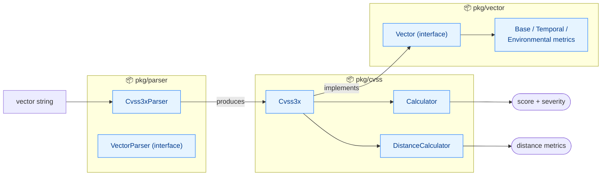

# API Reference

CVSS Skills provides a complete set of Go language APIs for parsing, calculating, and processing CVSS (Common Vulnerability Scoring System) vectors.

## Package Structure

CVSS Skills contains three main packages. `parser` turns strings into `vector`-typed structs, and `cvss` operates on them:



### 📦 [cvss](/api/cvss/)
Core package containing CVSS data structures, score calculators, and distance calculation functionality.

**Main Types:**
- `Cvss3x` - CVSS 3.x vector representation
- `Calculator` - CVSS score calculator
- `DistanceCalculator` - Vector distance calculator

### 📦 [parser](/api/parser/)
Parsing package responsible for parsing CVSS vector strings into structured data.

**Main Types:**
- `Cvss3xParser` - CVSS 3.x vector string parser
- `VectorParser` - Generic vector parser interface

### 📦 [vector](/api/vector/)
Vector package providing unified interfaces and implementations for all CVSS metrics.

**Main Types:**
- `Vector` - Unified interface for all metrics
- Specific implementations for base, temporal, and environmental metrics

## Quick Navigation

### 🚀 Getting Started
- [5-Minute Quick Start](/api/getting-started) - Fastest way to get started
- [Basic Examples](/examples/basic) - Simple usage examples

### 📚 Core Packages
- [CVSS Package Guide](/api/cvss/) - Core functionality introduction
- [Parser Usage](/api/parser/) - String parsing
- [Vector Analysis](/api/vector/) - Metric interfaces

### 💡 Practical Examples
- [JSON Processing](/examples/json) - Data serialization
- [Batch Processing](/examples/parsing) - Batch vector parsing
- [Similarity Analysis](/examples/distance) - Vector comparison

## Quick Start

### Basic Usage

```go
package main

import (
    "fmt"
    "log"

    "github.com/scagogogo/cvss-skills/pkg/cvss"
    "github.com/scagogogo/cvss-skills/pkg/parser"
)

func main() {
    // Parse CVSS vector
    p := parser.NewCvss3xParser("CVSS:3.1/AV:N/AC:L/PR:N/UI:N/S:U/C:H/I:H/A:H")
    vector, err := p.Parse()
    if err != nil {
        log.Fatalf("Parse failed: %v", err)
    }

    // Calculate score
    calculator := cvss.NewCalculator(vector)
    score, err := calculator.Calculate()
    if err != nil {
        log.Fatalf("Calculation failed: %v", err)
    }

    fmt.Printf("CVSS Score: %.1f\n", score)
    fmt.Printf("Severity: %s\n", calculator.GetSeverityRating(score))
}
```

### Advanced Features

```go
// Vector comparison
distCalc := cvss.NewDistanceCalculator(vector1, vector2)
distance := distCalc.EuclideanDistance()

// JSON serialization
jsonData, err := json.Marshal(vector)
```

## API Design Principles

### 🎯 Type Safety

All APIs use strong typing to catch errors at compile time:

```go
type Calculator interface {
    Calculate() (float64, error)
    GetSeverityRating(score float64) string
}
```

### 🔧 Flexible Configuration

Support multiple configuration options to adapt to different needs:

```go
// Strict mode parsing
parser := parser.NewCvss3xParser(vectorStr)
parser.SetStrictMode(true)

// Tolerant mode parsing
parser.SetStrictMode(false)
```

### 📊 Rich Error Information

Provide detailed error information to help with debugging:

```go
if err != nil {
    switch e := err.(type) {
    case *parser.ParseError:
        fmt.Printf("Parse error: %s (position: %d)", e.Message, e.Position)
    case *cvss.CalculationError:
        fmt.Printf("Calculation error: %s", e.Message)
    }
}
```

## Performance Characteristics

### ⚡ High Performance

- Zero-allocation parser design
- Optimized calculation algorithms
- Memory-friendly data structures

### 📈 Scalability

- Support for batch processing
- Concurrent-safe design
- Pluggable component architecture

## Version Compatibility

| CVSS Skills Version | CVSS Specification Support | Go Version Requirement |
|---------------------|----------------------------|------------------------|
| v1.x | CVSS 3.0, 3.1 | Go 1.19+ |
| v2.x | CVSS 3.0, 3.1, 4.0 | Go 1.21+ |

## Best Practices

### 🛡️ Error Handling

Always check errors and provide appropriate handling:

```go
vector, err := parser.Parse()
if err != nil {
    log.Printf("Parse failed: %v", err)
    return
}
```

### 🔄 Resource Management

For large data processing, consider using object pools:

```go
var parserPool = sync.Pool{
    New: func() interface{} {
        return parser.NewCvss3xParser("")
    },
}
```

### 📊 Performance Monitoring

Use built-in performance metrics:

```go
start := time.Now()
score, err := calculator.Calculate()
duration := time.Since(start)
log.Printf("Calculation took: %v", duration)
```

## Next Steps

- **[Getting Started](/api/getting-started)** - 5-minute quick start guide
- **[CVSS Package Deep Dive](/api/cvss/)** - Core functionality overview
- **[Example Code](/examples/)** - Practical usage examples
- **[Best Practices](/api/best-practices)** - Production environment recommendations

## Getting Help

If you encounter issues while using the API:

1. Check the [FAQ](/api/faq)
2. Browse [Example Code](/examples/)
3. Submit issues on [GitHub](https://github.com/scagogogo/cvss-skills/issues)
4. Join [Community Discussions](https://github.com/scagogogo/cvss-skills/discussions)