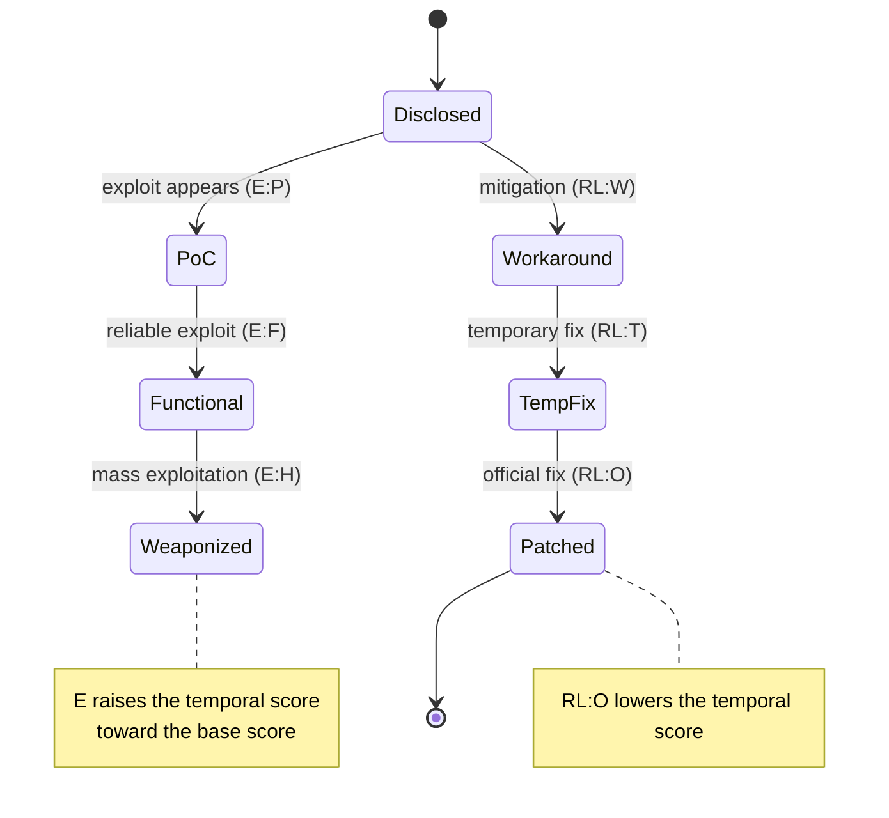

# Temporal Metrics Examples

This example demonstrates how to work with CVSS temporal metrics, which reflect the characteristics of a vulnerability that change over time.

## Overview

Temporal metrics allow you to adjust CVSS scores based on:

- **Exploit Code Maturity (E)** - Availability and sophistication of exploit code
- **Remediation Level (RL)** - Availability of fixes or workarounds
- **Report Confidence (RC)** - Confidence in the vulnerability report

These metrics help provide more accurate risk assessment by considering the current threat landscape.

## How Temporal Metrics Evolve

The three temporal metrics track a vulnerability's lifecycle. As an exploit matures and a fix ships, the temporal score moves — always **≤ the base score**:



## Basic Temporal Metrics

### Understanding Temporal Metrics

```go
package main

import (
    "fmt"
    "log"

    "github.com/scagogogo/cvss-skills/pkg/cvss"
    "github.com/scagogogo/cvss-skills/pkg/parser"
)

func main() {
    // Base vector without temporal metrics
    baseVector := "CVSS:3.1/AV:N/AC:L/PR:N/UI:N/S:U/C:H/I:H/A:H"
    
    // Same vector with temporal metrics
    temporalVector := "CVSS:3.1/AV:N/AC:L/PR:N/UI:N/S:U/C:H/I:H/A:H/E:F/RL:O/RC:C"

    fmt.Println("=== Temporal Metrics Impact ===")
    
    // Parse and calculate base score
    baseParser := parser.NewCvss3xParser(baseVector)
    baseParsed, err := baseParser.Parse()
    if err != nil {
        log.Fatal(err)
    }

    baseCalc := cvss.NewCalculator(baseParsed)
    baseScore, _ := baseCalc.Calculate()

    // Parse and calculate temporal score
    temporalParser := parser.NewCvss3xParser(temporalVector)
    temporalParsed, err := temporalParser.Parse()
    if err != nil {
        log.Fatal(err)
    }

    temporalCalc := cvss.NewCalculator(temporalParsed)
    temporalScore, _ := temporalCalc.Calculate()

    fmt.Printf("Base Vector: %s\n", baseVector)
    fmt.Printf("Base Score: %.1f (%s)\n", baseScore, baseCalc.GetSeverityRating(baseScore))
    fmt.Printf("\nTemporal Vector: %s\n", temporalVector)
    fmt.Printf("Temporal Score: %.1f (%s)\n", temporalScore, temporalCalc.GetSeverityRating(temporalScore))
    fmt.Printf("Score Reduction: %.1f points\n", baseScore-temporalScore)
}
```

### Temporal Metrics Breakdown

```go
func analyzeTemporalMetrics(vector *cvss.Cvss3x) {
    if !vector.HasTemporal() {
        fmt.Println("No temporal metrics present")
        return
    }

    fmt.Println("=== Temporal Metrics Analysis ===")
    
    temporal := vector.Cvss3xTemporal
    
    // Exploit Code Maturity
    if temporal.ExploitCodeMaturity != nil {
        fmt.Printf("Exploit Code Maturity: %s (%c)\n",
            temporal.ExploitCodeMaturity.GetLongValue(),
            temporal.ExploitCodeMaturity.GetShortValue())
        fmt.Printf("  Score Multiplier: %.2f\n", temporal.ExploitCodeMaturity.GetScore())
        fmt.Printf("  Description: %s\n", temporal.ExploitCodeMaturity.GetDescription())
    }

    // Remediation Level
    if temporal.RemediationLevel != nil {
        fmt.Printf("\nRemediation Level: %s (%c)\n",
            temporal.RemediationLevel.GetLongValue(),
            temporal.RemediationLevel.GetShortValue())
        fmt.Printf("  Score Multiplier: %.2f\n", temporal.RemediationLevel.GetScore())
        fmt.Printf("  Description: %s\n", temporal.RemediationLevel.GetDescription())
    }

    // Report Confidence
    if temporal.ReportConfidence != nil {
        fmt.Printf("\nReport Confidence: %s (%c)\n",
            temporal.ReportConfidence.GetLongValue(),
            temporal.ReportConfidence.GetShortValue())
        fmt.Printf("  Score Multiplier: %.2f\n", temporal.ReportConfidence.GetScore())
        fmt.Printf("  Description: %s\n", temporal.ReportConfidence.GetDescription())
    }
}
```

## Exploit Code Maturity (E)

### Different Maturity Levels

```go
func demonstrateExploitMaturity() {
    baseVector := "CVSS:3.1/AV:N/AC:L/PR:N/UI:N/S:U/C:H/I:H/A:H"
    
    exploitLevels := map[string]string{
        "Not Defined":      baseVector + "/E:X",
        "Unproven":         baseVector + "/E:U", 
        "Proof-of-Concept": baseVector + "/E:P",
        "Functional":       baseVector + "/E:F",
        "High":             baseVector + "/E:H",
    }

    fmt.Println("=== Exploit Code Maturity Impact ===")
    
    for level, vectorStr := range exploitLevels {
        parser := parser.NewCvss3xParser(vectorStr)
        vector, err := parser.Parse()
        if err != nil {
            continue
        }

        calculator := cvss.NewCalculator(vector)
        score, _ := calculator.Calculate()

        fmt.Printf("%-20s: %.1f", level, score)
        if vector.HasTemporal() && vector.Cvss3xTemporal.ExploitCodeMaturity != nil {
            multiplier := vector.Cvss3xTemporal.ExploitCodeMaturity.GetScore()
            fmt.Printf(" (multiplier: %.2f)", multiplier)
        }
        fmt.Println()
    }
}
```

### Exploit Evolution Tracking

```go
func trackExploitEvolution(baseVector string) {
    stages := []struct {
        stage       string
        exploitCode string
        description string
    }{
        {"Discovery", "E:X", "Vulnerability just discovered"},
        {"Research", "E:U", "Researchers investigating"},
        {"PoC Released", "E:P", "Proof-of-concept code available"},
        {"Working Exploit", "E:F", "Functional exploit code available"},
        {"Weaponized", "E:H", "Sophisticated exploit tools available"},
    }

    fmt.Println("=== Exploit Evolution Timeline ===")
    fmt.Printf("Base Vector: %s\n\n", baseVector)

    for i, stage := range stages {
        vectorStr := baseVector + "/" + stage.exploitCode
        
        parser := parser.NewCvss3xParser(vectorStr)
        vector, _ := parser.Parse()
        
        calculator := cvss.NewCalculator(vector)
        score, _ := calculator.Calculate()
        severity := calculator.GetSeverityRating(score)

        fmt.Printf("Stage %d: %s\n", i+1, stage.stage)
        fmt.Printf("  Vector: %s\n", vectorStr)
        fmt.Printf("  Score: %.1f (%s)\n", score, severity)
        fmt.Printf("  Description: %s\n", stage.description)
        fmt.Println()
    }
}
```

## Remediation Level (RL)

### Remediation Progression

```go
func demonstrateRemediationLevels() {
    baseVector := "CVSS:3.1/AV:N/AC:L/PR:N/UI:N/S:U/C:H/I:H/A:H"
    
    remediationLevels := map[string]string{
        "Not Defined":    baseVector + "/RL:X",
        "Official Fix":   baseVector + "/RL:O",
        "Temporary Fix":  baseVector + "/RL:T",
        "Workaround":     baseVector + "/RL:W",
        "Unavailable":    baseVector + "/RL:U",
    }

    fmt.Println("=== Remediation Level Impact ===")
    
    for level, vectorStr := range remediationLevels {
        parser := parser.NewCvss3xParser(vectorStr)
        vector, err := parser.Parse()
        if err != nil {
            continue
        }

        calculator := cvss.NewCalculator(vector)
        score, _ := calculator.Calculate()

        fmt.Printf("%-15s: %.1f", level, score)
        if vector.HasTemporal() && vector.Cvss3xTemporal.RemediationLevel != nil {
            multiplier := vector.Cvss3xTemporal.RemediationLevel.GetScore()
            fmt.Printf(" (multiplier: %.2f)", multiplier)
        }
        fmt.Println()
    }
}
```

### Remediation Timeline

```go
func trackRemediationProgress(baseVector string) {
    timeline := []struct {
        day         int
        remediation string
        description string
    }{
        {0, "RL:U", "Vulnerability disclosed, no fix available"},
        {7, "RL:W", "Workaround published"},
        {14, "RL:T", "Temporary patch released"},
        {30, "RL:O", "Official fix released"},
    }

    fmt.Println("=== Remediation Timeline ===")
    fmt.Printf("Base Vector: %s\n\n", baseVector)

    for _, entry := range timeline {
        vectorStr := baseVector + "/" + entry.remediation
        
        parser := parser.NewCvss3xParser(vectorStr)
        vector, _ := parser.Parse()
        
        calculator := cvss.NewCalculator(vector)
        score, _ := calculator.Calculate()
        severity := calculator.GetSeverityRating(score)

        fmt.Printf("Day %d: %s\n", entry.day, entry.description)
        fmt.Printf("  Vector: %s\n", vectorStr)
        fmt.Printf("  Score: %.1f (%s)\n", score, severity)
        fmt.Println()
    }
}
```

## Report Confidence (RC)

### Confidence Levels

```go
func demonstrateReportConfidence() {
    baseVector := "CVSS:3.1/AV:N/AC:L/PR:N/UI:N/S:U/C:H/I:H/A:H"
    
    confidenceLevels := map[string]string{
        "Not Defined": baseVector + "/RC:X",
        "Unknown":     baseVector + "/RC:U",
        "Reasonable":  baseVector + "/RC:R", 
        "Confirmed":   baseVector + "/RC:C",
    }

    fmt.Println("=== Report Confidence Impact ===")
    
    for level, vectorStr := range confidenceLevels {
        parser := parser.NewCvss3xParser(vectorStr)
        vector, err := parser.Parse()
        if err != nil {
            continue
        }

        calculator := cvss.NewCalculator(vector)
        score, _ := calculator.Calculate()

        fmt.Printf("%-15s: %.1f", level, score)
        if vector.HasTemporal() && vector.Cvss3xTemporal.ReportConfidence != nil {
            multiplier := vector.Cvss3xTemporal.ReportConfidence.GetScore()
            fmt.Printf(" (multiplier: %.2f)", multiplier)
        }
        fmt.Println()
    }
}
```

### Confidence Evolution

```go
func trackConfidenceEvolution(baseVector string) {
    stages := []struct {
        stage       string
        confidence  string
        description string
    }{
        {"Initial Report", "RC:U", "Unverified vulnerability report"},
        {"Analysis", "RC:R", "Reasonable confidence after analysis"},
        {"Reproduction", "RC:C", "Vulnerability confirmed and reproduced"},
    }

    fmt.Println("=== Confidence Evolution ===")
    fmt.Printf("Base Vector: %s\n\n", baseVector)

    for i, stage := range stages {
        vectorStr := baseVector + "/" + stage.confidence
        
        parser := parser.NewCvss3xParser(vectorStr)
        vector, _ := parser.Parse()
        
        calculator := cvss.NewCalculator(vector)
        score, _ := calculator.Calculate()
        severity := calculator.GetSeverityRating(score)

        fmt.Printf("Stage %d: %s\n", i+1, stage.stage)
        fmt.Printf("  Vector: %s\n", vectorStr)
        fmt.Printf("  Score: %.1f (%s)\n", score, severity)
        fmt.Printf("  Description: %s\n", stage.description)
        fmt.Println()
    }
}
```

## Combined Temporal Analysis

### Complete Temporal Scenarios

```go
func analyzeTemporalScenarios() {
    baseVector := "CVSS:3.1/AV:N/AC:L/PR:N/UI:N/S:U/C:H/I:H/A:H"
    
    scenarios := []struct {
        name        string
        temporal    string
        description string
    }{
        {
            "Worst Case",
            "/E:H/RL:U/RC:C",
            "High exploit maturity, no remediation, confirmed",
        },
        {
            "Best Case", 
            "/E:U/RL:O/RC:R",
            "Unproven exploit, official fix, reasonable confidence",
        },
        {
            "Typical Case",
            "/E:F/RL:T/RC:C", 
            "Functional exploit, temporary fix, confirmed",
        },
        {
            "Early Stage",
            "/E:P/RL:W/RC:R",
            "PoC available, workaround exists, reasonable confidence",
        },
    }

    fmt.Println("=== Temporal Scenarios Analysis ===")
    fmt.Printf("Base Vector: %s\n", baseVector)
    
    baseParser := parser.NewCvss3xParser(baseVector)
    baseVector_parsed, _ := baseParser.Parse()
    baseCalc := cvss.NewCalculator(baseVector_parsed)
    baseScore, _ := baseCalc.Calculate()
    
    fmt.Printf("Base Score: %.1f\n\n", baseScore)

    for _, scenario := range scenarios {
        vectorStr := baseVector + scenario.temporal
        
        parser := parser.NewCvss3xParser(vectorStr)
        vector, _ := parser.Parse()
        
        calculator := cvss.NewCalculator(vector)
        score, _ := calculator.Calculate()
        severity := calculator.GetSeverityRating(score)
        reduction := baseScore - score

        fmt.Printf("Scenario: %s\n", scenario.name)
        fmt.Printf("  Vector: %s\n", vectorStr)
        fmt.Printf("  Score: %.1f (%s)\n", score, severity)
        fmt.Printf("  Reduction: %.1f points\n", reduction)
        fmt.Printf("  Description: %s\n", scenario.description)
        fmt.Println()
    }
}
```

### Temporal Score Calculation

```go
func explainTemporalCalculation(vector *cvss.Cvss3x) {
    if !vector.HasTemporal() {
        fmt.Println("No temporal metrics to analyze")
        return
    }

    calculator := cvss.NewCalculator(vector)
    
    // Get individual scores
    baseScore, _ := calculator.CalculateBaseScore()
    temporalScore, _ := calculator.CalculateTemporalScore()

    fmt.Println("=== Temporal Score Calculation ===")
    fmt.Printf("Base Score: %.1f\n", baseScore)
    
    temporal := vector.Cvss3xTemporal
    
    // Show multipliers
    eMultiplier := 1.0
    if temporal.ExploitCodeMaturity != nil {
        eMultiplier = temporal.ExploitCodeMaturity.GetScore()
    }
    
    rlMultiplier := 1.0
    if temporal.RemediationLevel != nil {
        rlMultiplier = temporal.RemediationLevel.GetScore()
    }
    
    rcMultiplier := 1.0
    if temporal.ReportConfidence != nil {
        rcMultiplier = temporal.ReportConfidence.GetScore()
    }

    fmt.Printf("\nTemporal Multipliers:\n")
    fmt.Printf("  Exploit Code Maturity: %.2f\n", eMultiplier)
    fmt.Printf("  Remediation Level: %.2f\n", rlMultiplier)
    fmt.Printf("  Report Confidence: %.2f\n", rcMultiplier)
    
    combinedMultiplier := eMultiplier * rlMultiplier * rcMultiplier
    fmt.Printf("  Combined Multiplier: %.3f\n", combinedMultiplier)
    
    fmt.Printf("\nCalculation:\n")
    fmt.Printf("  Temporal Score = Base Score × Combined Multiplier\n")
    fmt.Printf("  Temporal Score = %.1f × %.3f = %.1f\n", 
        baseScore, combinedMultiplier, temporalScore)
}
```

## Practical Applications

### Risk Assessment Over Time

```go
func assessRiskOverTime(baseVector string, days int) {
    fmt.Println("=== Risk Assessment Timeline ===")
    fmt.Printf("Base Vector: %s\n\n", baseVector)

    timeline := []struct {
        day     int
        metrics string
        event   string
    }{
        {0, "/E:X/RL:U/RC:U", "Vulnerability discovered"},
        {1, "/E:U/RL:U/RC:R", "Initial analysis completed"},
        {3, "/E:P/RL:U/RC:C", "PoC published"},
        {7, "/E:P/RL:W/RC:C", "Workaround available"},
        {14, "/E:F/RL:W/RC:C", "Working exploit released"},
        {21, "/E:F/RL:T/RC:C", "Temporary patch available"},
        {30, "/E:H/RL:O/RC:C", "Official fix released, exploit weaponized"},
    }

    for _, entry := range timeline {
        if entry.day > days {
            break
        }

        vectorStr := baseVector + entry.metrics
        parser := parser.NewCvss3xParser(vectorStr)
        vector, _ := parser.Parse()
        
        calculator := cvss.NewCalculator(vector)
        score, _ := calculator.Calculate()
        severity := calculator.GetSeverityRating(score)

        fmt.Printf("Day %2d: %s\n", entry.day, entry.event)
        fmt.Printf("        Score: %.1f (%s)\n", score, severity)
        fmt.Printf("        Vector: %s\n", vectorStr)
        fmt.Println()
    }
}
```

### Vulnerability Lifecycle Management

```go
func manageVulnerabilityLifecycle(baseVector string) {
    phases := []struct {
        phase   string
        metrics string
        actions []string
    }{
        {
            "Discovery",
            "/E:X/RL:U/RC:U",
            []string{"Verify vulnerability", "Assess impact", "Notify stakeholders"},
        },
        {
            "Analysis", 
            "/E:U/RL:U/RC:R",
            []string{"Develop workarounds", "Plan remediation", "Monitor for exploits"},
        },
        {
            "Exploitation",
            "/E:F/RL:W/RC:C", 
            []string{"Deploy workarounds", "Accelerate patching", "Increase monitoring"},
        },
        {
            "Remediation",
            "/E:F/RL:O/RC:C",
            []string{"Deploy patches", "Verify fixes", "Update documentation"},
        },
    }

    fmt.Println("=== Vulnerability Lifecycle Management ===")
    fmt.Printf("Base Vector: %s\n\n", baseVector)

    for i, phase := range phases {
        vectorStr := baseVector + phase.metrics
        parser := parser.NewCvss3xParser(vectorStr)
        vector, _ := parser.Parse()
        
        calculator := cvss.NewCalculator(vector)
        score, _ := calculator.Calculate()
        severity := calculator.GetSeverityRating(score)

        fmt.Printf("Phase %d: %s\n", i+1, phase.phase)
        fmt.Printf("  Score: %.1f (%s)\n", score, severity)
        fmt.Printf("  Vector: %s\n", vectorStr)
        fmt.Printf("  Actions:\n")
        for _, action := range phase.actions {
            fmt.Printf("    - %s\n", action)
        }
        fmt.Println()
    }
}
```

## Testing and Validation

### Temporal Metrics Validation

```go
func validateTemporalMetrics(vector *cvss.Cvss3x) []string {
    var issues []string

    if !vector.HasTemporal() {
        return issues
    }

    temporal := vector.Cvss3xTemporal

    // Validate Exploit Code Maturity
    if temporal.ExploitCodeMaturity != nil {
        value := temporal.ExploitCodeMaturity.GetShortValue()
        if value != 'X' && value != 'U' && value != 'P' && value != 'F' && value != 'H' {
            issues = append(issues, fmt.Sprintf("Invalid Exploit Code Maturity: %c", value))
        }
    }

    // Validate Remediation Level
    if temporal.RemediationLevel != nil {
        value := temporal.RemediationLevel.GetShortValue()
        if value != 'X' && value != 'O' && value != 'T' && value != 'W' && value != 'U' {
            issues = append(issues, fmt.Sprintf("Invalid Remediation Level: %c", value))
        }
    }

    // Validate Report Confidence
    if temporal.ReportConfidence != nil {
        value := temporal.ReportConfidence.GetShortValue()
        if value != 'X' && value != 'U' && value != 'R' && value != 'C' {
            issues = append(issues, fmt.Sprintf("Invalid Report Confidence: %c", value))
        }
    }

    return issues
}
```

## Next Steps

After mastering temporal metrics, you can explore:

- [Environmental Metrics](/examples/environmental) - Context-specific scoring
- [Vector Comparison](/examples/comparison) - Comparing different vectors
- [Advanced Examples](/examples/edge-cases) - Complex scenarios

## Related Documentation

- [Temporal Metrics API](/api/cvss/temporal) - Detailed API reference
- [CVSS Specification](https://www.first.org/cvss/) - Official CVSS documentation
- [Vulnerability Management](/examples/management) - Lifecycle management examples
