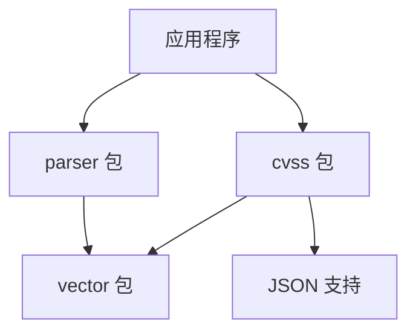

# API 概述

CVSS Skills 提供了一套完整的 API 来处理 CVSS (通用漏洞评分系统) 向量。本文档涵盖了所有可用的包、类型和函数。

## 核心包

### 📦 [cvss 包](/zh/api/cvss/)

核心计算和数据结构包，提供：

- **[Calculator](/zh/api/cvss/calculator)** - CVSS 评分计算器
- **[Cvss3x](/zh/api/cvss/cvss3x)** - CVSS 3.x 数据结构
- **[DistanceCalculator](/zh/api/cvss/distance)** - 向量距离计算
- **[JSON 支持](/zh/api/cvss/json)** - 序列化和反序列化

### 🔍 [parser 包](/zh/api/parser/)

向量解析包，提供：

- **[Cvss3xParser](/zh/api/parser/cvss3x-parser)** - CVSS 3.x 向量解析器
- 灵活的解析选项和错误处理

### 🎯 [vector 包](/zh/api/vector/)

向量接口和实现，提供：

- **[Vector 接口](/zh/api/vector/interface)** - 统一的向量接口
- 基础、时间和环境指标的具体实现

## 快速开始

### 基本用法

```go
import (
    "github.com/scagogogo/cvss-skills/pkg/cvss"
    "github.com/scagogogo/cvss-skills/pkg/parser"
)

// 解析向量
p := parser.NewCvss3xParser("CVSS:3.1/AV:N/AC:L/PR:N/UI:N/S:U/C:H/I:H/A:H")
vector, err := p.Parse()

// 计算评分
calculator := cvss.NewCalculator(vector)
score, err := calculator.Calculate()
```

### 高级功能

```go
// 向量比较
distCalc := cvss.NewDistanceCalculator(vector1, vector2)
distance := distCalc.EuclideanDistance()

// JSON 序列化
jsonData, err := json.Marshal(vector)
```

## API 设计原则

### 🎯 类型安全

所有 API 都使用强类型设计，在编译时捕获错误：

```go
type Calculator interface {
    Calculate() (float64, error)
    GetSeverityRating(score float64) string
}
```

### 🔧 灵活配置

支持多种配置选项以适应不同需求：

```go
// 严格模式解析
parser := parser.NewCvss3xParser(vectorStr)
parser.SetStrictMode(true)

// 容错模式解析
parser.SetStrictMode(false)
```

### 📊 丰富的错误信息

提供详细的错误信息帮助调试：

```go
if err != nil {
    switch e := err.(type) {
    case *parser.ParseError:
        fmt.Printf("解析错误: %s (位置: %d)", e.Message, e.Position)
    case *cvss.CalculationError:
        fmt.Printf("计算错误: %s", e.Message)
    }
}
```

## 包依赖关系



## 性能特性

### ⚡ 高性能

- 零分配的解析器设计
- 优化的计算算法
- 内存友好的数据结构

### 📈 可扩展性

- 支持批量处理
- 并发安全的设计
- 可插拔的组件架构

## 版本兼容性

| CVSS Skills 版本 | CVSS 规范支持 | Go 版本要求 |
|------------------|---------------|-------------|
| v1.x | CVSS 3.0, 3.1 | Go 1.19+ |
| v2.x | CVSS 3.0, 3.1, 4.0 | Go 1.21+ |

## 最佳实践

### 🛡️ 错误处理

始终检查错误并提供适当的处理：

```go
vector, err := parser.Parse()
if err != nil {
    log.Printf("解析失败: %v", err)
    return
}
```

### 🔄 资源管理

对于大量数据处理，考虑使用对象池：

```go
var parserPool = sync.Pool{
    New: func() interface{} {
        return parser.NewCvss3xParser("")
    },
}
```

### 📊 性能监控

使用内置的性能指标：

```go
start := time.Now()
score, err := calculator.Calculate()
duration := time.Since(start)
log.Printf("计算耗时: %v", duration)
```

## 下一步

- **[快速开始](/zh/api/getting-started)** - 5分钟上手指南
- **[CVSS 包详解](/zh/api/cvss/)** - 核心功能深入了解
- **[示例代码](/zh/examples/)** - 实际使用示例
- **[最佳实践](/zh/api/best-practices)** - 生产环境建议

## 获取帮助

如果你在使用 API 时遇到问题：

1. 查看 [常见问题](/zh/api/faq)
2. 浏览 [示例代码](/zh/examples/)
3. 在 [GitHub](https://github.com/scagogogo/cvss-skills/issues) 上提交问题
4. 参与 [社区讨论](https://github.com/scagogogo/cvss-skills/discussions)
