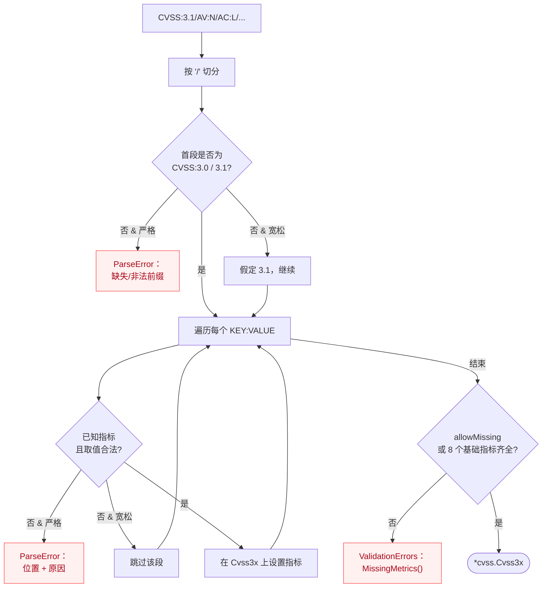

# Cvss3xParser 解析器

`Cvss3xParser` 是专门用于解析 CVSS 3.x 向量字符串的解析器。它提供了灵活的解析选项、详细的错误处理和高性能的解析能力。

## 解析流程

解析器按 `/` 切分字符串，先读版本前缀，再逐个处理 `KEY:VALUE` 指标段。严格模式决定如何对待未知/缺失指标：



## 类型定义

```go
type Cvss3xParser struct {
    vector      string
    strictMode  bool
    allowMissing bool
    validator   func(metric, value string) error
}
```

## 创建解析器

### NewCvss3xParser

```go
func NewCvss3xParser(vector string) *Cvss3xParser
```

创建一个新的 CVSS 3.x 解析器实例。

**参数：**
- `vector`: 要解析的 CVSS 向量字符串

**返回值：**
- `*Cvss3xParser`: 解析器实例

**示例：**
```go
parser := parser.NewCvss3xParser("CVSS:3.1/AV:N/AC:L/PR:N/UI:N/S:U/C:H/I:H/A:H")
```

## 主要方法

### Parse

```go
func (p *Cvss3xParser) Parse() (*cvss.Cvss3x, error)
```

解析 CVSS 向量字符串并返回结构化的 CVSS 对象。

**返回值：**
- `*cvss.Cvss3x`: 解析后的 CVSS 向量对象
- `error`: 解析错误

**示例：**
```go
vector, err := parser.Parse()
if err != nil {
    log.Fatalf("解析失败: %v", err)
}

fmt.Printf("解析成功: %s\n", vector.String())
```

### SetVector

```go
func (p *Cvss3xParser) SetVector(vector string)
```

设置要解析的向量字符串。用于重用解析器实例。

**参数：**
- `vector`: 新的 CVSS 向量字符串

**示例：**
```go
parser := parser.NewCvss3xParser("")

vectors := []string{
    "CVSS:3.1/AV:N/AC:L/PR:N/UI:N/S:U/C:H/I:H/A:H",
    "CVSS:3.1/AV:L/AC:H/PR:H/UI:R/S:U/C:L/I:L/A:L",
}

for _, vectorStr := range vectors {
    parser.SetVector(vectorStr)
    vector, err := parser.Parse()
    if err != nil {
        continue
    }
    
    // 处理向量...
}
```

### SetStrictMode

```go
func (p *Cvss3xParser) SetStrictMode(strict bool)
```

设置解析器的严格模式。

**参数：**
- `strict`: 是否启用严格模式

**严格模式特性：**
- 严格验证向量格式
- 不允许未知的指标
- 要求所有必需指标存在
- 严格的值验证

**示例：**
```go
parser := parser.NewCvss3xParser(vectorStr)
parser.SetStrictMode(true) // 启用严格模式

vector, err := parser.Parse()
```

### SetAllowMissingMetrics

```go
func (p *Cvss3xParser) SetAllowMissingMetrics(allow bool)
```

设置是否允许缺少某些指标。

**参数：**
- `allow`: 是否允许缺少指标

**示例：**
```go
parser := parser.NewCvss3xParser(vectorStr)
parser.SetAllowMissingMetrics(true) // 允许缺少某些指标

vector, err := parser.Parse()
```

### SetCustomValidator

```go
func (p *Cvss3xParser) SetCustomValidator(validator func(metric, value string) error)
```

设置自定义验证函数。

**参数：**
- `validator`: 自定义验证函数

**示例：**
```go
parser := parser.NewCvss3xParser(vectorStr)
parser.SetCustomValidator(func(metric, value string) error {
    // 自定义验证逻辑
    if metric == "AV" && value == "X" {
        return fmt.Errorf("不支持的攻击向量值: %s", value)
    }
    return nil
})

vector, err := parser.Parse()
```

## 解析过程

### 1. 词法分析

解析器首先将向量字符串分解为标记：

```
CVSS:3.1/AV:N/AC:L/PR:N/UI:N/S:U/C:H/I:H/A:H
```

分解为：
- 版本: `CVSS:3.1`
- 指标: `AV:N`, `AC:L`, `PR:N`, 等

### 2. 语法分析

验证向量的语法结构：
- 检查版本格式
- 验证指标格式
- 确保分隔符正确

### 3. 语义验证

验证指标的语义正确性：
- 检查指标名称的有效性
- 验证指标值的合法性
- 确保必需指标存在

### 4. 对象构建

根据解析结果构建 CVSS 对象：
- 创建相应的向量对象
- 设置指标值
- 建立对象关系

## 错误处理

### 错误类型

#### ParseError

```go
type ParseError struct {
    Message  string
    Position int
    Input    string
}
```

表示解析过程中的错误。

**示例：**
```go
vector, err := parser.Parse()
if err != nil {
    if parseErr, ok := err.(*parser.ParseError); ok {
        fmt.Printf("解析错误: %s\n", parseErr.Message)
        fmt.Printf("错误位置: %d\n", parseErr.Position)
        fmt.Printf("输入内容: %s\n", parseErr.Input)
    }
}
```

#### ValidationError

```go
type ValidationError struct {
    Message string
    Metric  string
    Value   string
}
```

表示验证过程中的错误。

**示例：**
```go
vector, err := parser.Parse()
if err != nil {
    if valErr, ok := err.(*parser.ValidationError); ok {
        fmt.Printf("验证错误: %s\n", valErr.Message)
        fmt.Printf("问题指标: %s\n", valErr.Metric)
        fmt.Printf("问题值: %s\n", valErr.Value)
    }
}
```

### 错误处理最佳实践

```go
func parseWithErrorHandling(vectorStr string) (*cvss.Cvss3x, error) {
    parser := parser.NewCvss3xParser(vectorStr)
    
    vector, err := parser.Parse()
    if err != nil {
        switch e := err.(type) {
        case *parser.ParseError:
            return nil, fmt.Errorf("解析错误在位置 %d: %s", e.Position, e.Message)
        case *parser.ValidationError:
            return nil, fmt.Errorf("验证错误 - 指标 %s 值 %s: %s", e.Metric, e.Value, e.Message)
        default:
            return nil, fmt.Errorf("未知解析错误: %w", err)
        }
    }
    
    return vector, nil
}
```

## 使用示例

### 基本解析

```go
package main

import (
    "fmt"
    "log"
    
    "github.com/scagogogo/cvss-skills/pkg/parser"
)

func main() {
    vectorStr := "CVSS:3.1/AV:N/AC:L/PR:N/UI:N/S:U/C:H/I:H/A:H"
    
    // 创建解析器
    parser := parser.NewCvss3xParser(vectorStr)
    
    // 解析向量
    vector, err := parser.Parse()
    if err != nil {
        log.Fatalf("解析失败: %v", err)
    }
    
    // 输出结果
    fmt.Printf("原始向量: %s\n", vectorStr)
    fmt.Printf("解析结果: %s\n", vector.String())
    fmt.Printf("版本: %d.%d\n", vector.MajorVersion, vector.MinorVersion)
}
```

### 批量解析

```go
func parseBatch(vectors []string) {
    parser := parser.NewCvss3xParser("")
    
    for i, vectorStr := range vectors {
        parser.SetVector(vectorStr)
        
        vector, err := parser.Parse()
        if err != nil {
            fmt.Printf("向量 %d 解析失败: %v\n", i+1, err)
            continue
        }
        
        fmt.Printf("向量 %d: %s -> 解析成功\n", i+1, vectorStr)
    }
}
```

### 容错解析

```go
func tolerantParsing(vectorStr string) (*cvss.Cvss3x, error) {
    parser := parser.NewCvss3xParser(vectorStr)
    
    // 启用容错模式
    parser.SetStrictMode(false)
    parser.SetAllowMissingMetrics(true)
    
    // 设置自定义验证器
    parser.SetCustomValidator(func(metric, value string) error {
        // 允许某些非标准值
        if metric == "AV" && value == "X" {
            return nil // 忽略未知值
        }
        return nil
    })
    
    return parser.Parse()
}
```

### 严格解析

```go
func strictParsing(vectorStr string) (*cvss.Cvss3x, error) {
    parser := parser.NewCvss3xParser(vectorStr)
    
    // 启用严格模式
    parser.SetStrictMode(true)
    parser.SetAllowMissingMetrics(false)
    
    // 设置严格的自定义验证器
    parser.SetCustomValidator(func(metric, value string) error {
        // 额外的验证逻辑
        if metric == "AV" && value == "N" {
            // 检查网络攻击向量的额外条件
            return nil
        }
        return nil
    })
    
    return parser.Parse()
}
```

## 性能优化

### 重用解析器

```go
type VectorProcessor struct {
    parser *parser.Cvss3xParser
}

func NewVectorProcessor() *VectorProcessor {
    return &VectorProcessor{
        parser: parser.NewCvss3xParser(""),
    }
}

func (vp *VectorProcessor) ProcessVector(vectorStr string) (*cvss.Cvss3x, error) {
    vp.parser.SetVector(vectorStr)
    return vp.parser.Parse()
}
```

### 并发解析

```go
func parseVectorsConcurrently(vectors []string) []*cvss.Cvss3x {
    results := make([]*cvss.Cvss3x, len(vectors))
    var wg sync.WaitGroup
    
    for i, vectorStr := range vectors {
        wg.Add(1)
        go func(index int, vector string) {
            defer wg.Done()
            
            parser := parser.NewCvss3xParser(vector)
            result, err := parser.Parse()
            if err != nil {
                results[index] = nil
                return
            }
            
            results[index] = result
        }(i, vectorStr)
    }
    
    wg.Wait()
    return results
}
```

### 对象池

```go
var parserPool = sync.Pool{
    New: func() interface{} {
        return parser.NewCvss3xParser("")
    },
}

func parseWithPool(vectorStr string) (*cvss.Cvss3x, error) {
    parser := parserPool.Get().(*parser.Cvss3xParser)
    defer parserPool.Put(parser)
    
    parser.SetVector(vectorStr)
    return parser.Parse()
}
```

## 支持的向量格式

### CVSS 3.0

```
CVSS:3.0/AV:N/AC:L/PR:N/UI:N/S:U/C:H/I:H/A:H
```

### CVSS 3.1

```
CVSS:3.1/AV:N/AC:L/PR:N/UI:N/S:U/C:H/I:H/A:H
```

### 包含时间指标

```
CVSS:3.1/AV:N/AC:L/PR:N/UI:N/S:U/C:H/I:H/A:H/E:F/RL:O/RC:C
```

### 包含环境指标

```
CVSS:3.1/AV:N/AC:L/PR:N/UI:N/S:U/C:H/I:H/A:H/CR:H/IR:H/AR:H
```

## 最佳实践

### 1. 输入验证

```go
func validateInput(vectorStr string) error {
    if vectorStr == "" {
        return fmt.Errorf("向量字符串不能为空")
    }
    
    if !strings.HasPrefix(vectorStr, "CVSS:") {
        return fmt.Errorf("无效的向量格式")
    }
    
    return nil
}
```

### 2. 错误恢复

```go
func parseWithRecovery(vectorStr string) (*cvss.Cvss3x, error) {
    // 首先尝试严格解析
    parser := parser.NewCvss3xParser(vectorStr)
    parser.SetStrictMode(true)
    
    vector, err := parser.Parse()
    if err == nil {
        return vector, nil
    }
    
    // 如果失败，尝试容错解析
    parser.SetStrictMode(false)
    parser.SetAllowMissingMetrics(true)
    
    return parser.Parse()
}
```

### 3. 日志记录

```go
func parseWithLogging(vectorStr string) (*cvss.Cvss3x, error) {
    start := time.Now()
    defer func() {
        duration := time.Since(start)
        log.Printf("解析耗时: %v", duration)
    }()
    
    parser := parser.NewCvss3xParser(vectorStr)
    vector, err := parser.Parse()
    
    if err != nil {
        log.Printf("解析失败 '%s': %v", vectorStr, err)
        return nil, err
    }
    
    log.Printf("解析成功 '%s'", vectorStr)
    return vector, nil
}
```

## 相关文档

- [parser 包概述](/zh/api/parser/)
- [Cvss3x 数据结构](/zh/api/cvss/cvss3x)
- [错误处理指南](/zh/api/error-handling)
- [解析示例](/zh/examples/parsing)
