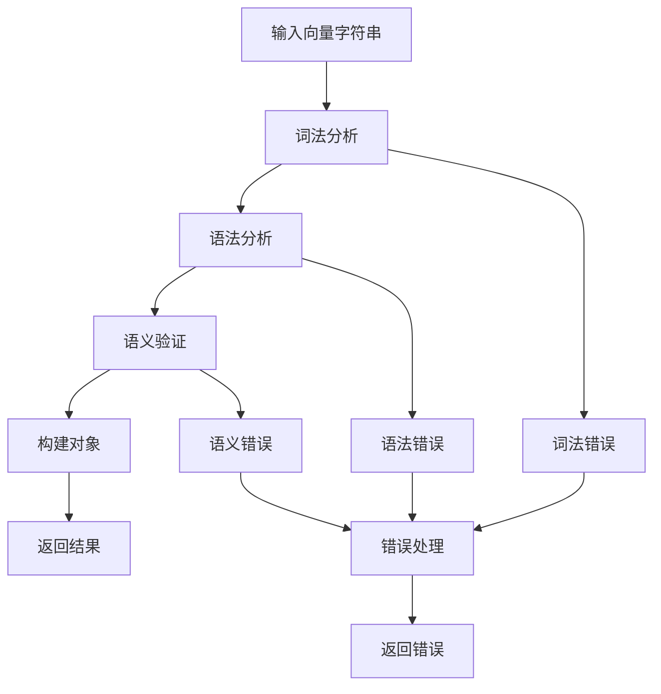

# parser 包

`parser` 包提供了将 CVSS 向量字符串解析为结构化对象的功能。它支持 CVSS 3.0 和 3.1 版本，提供灵活的解析选项和详细的错误处理。

## 包概述

```go
import "github.com/scagogogo/cvss-skills/pkg/parser"
```

## 主要类型

### 解析器

| 类型 | 描述 | 文档链接 |
|------|------|----------|
| `Cvss3xParser` | CVSS 3.x 向量解析器 | [详细文档](/zh/api/parser/cvss3x-parser) |

### 接口

| 接口 | 描述 |
|------|------|
| `Parser` | 通用解析器接口 |
| `VectorParser` | 向量解析器接口 |

## 快速开始

### 基本解析

```go
// 创建解析器
vectorStr := "CVSS:3.1/AV:N/AC:L/PR:N/UI:N/S:U/C:H/I:H/A:H"
parser := parser.NewCvss3xParser(vectorStr)

// 解析向量
vector, err := parser.Parse()
if err != nil {
    log.Fatalf("解析失败: %v", err)
}

fmt.Printf("解析成功: %s\n", vector.String())
```

### 批量解析

```go
vectors := []string{
    "CVSS:3.1/AV:N/AC:L/PR:N/UI:N/S:U/C:H/I:H/A:H",
    "CVSS:3.1/AV:L/AC:H/PR:H/UI:R/S:U/C:L/I:L/A:L",
    "CVSS:3.0/AV:N/AC:L/PR:L/UI:N/S:C/C:H/I:H/A:H",
}

for _, vectorStr := range vectors {
    parser := parser.NewCvss3xParser(vectorStr)
    vector, err := parser.Parse()
    if err != nil {
        fmt.Printf("解析失败 %s: %v\n", vectorStr, err)
        continue
    }
    
    fmt.Printf("成功解析: %s\n", vector.String())
}
```

## 解析器特性

### 🎯 准确解析

- **严格验证**: 确保向量格式和值的正确性
- **版本支持**: 完整支持 CVSS 3.0 和 3.1
- **指标验证**: 验证所有指标值的有效性

### 🔧 灵活配置

- **严格模式**: 严格按照规范解析
- **容错模式**: 允许某些格式变化
- **自定义验证**: 可配置的验证规则

### 📊 详细错误

- **位置信息**: 精确的错误位置
- **错误类型**: 分类的错误信息
- **修复建议**: 提供修复指导

## 解析流程



## 错误处理

### 错误类型

```go
// 解析错误
type ParseError struct {
    Message  string
    Position int
    Input    string
}

// 验证错误
type ValidationError struct {
    Message string
    Metric  string
    Value   string
}

// 格式错误
type FormatError struct {
    Message  string
    Expected string
    Actual   string
}
```

### 错误处理示例

```go
vector, err := parser.Parse()
if err != nil {
    switch e := err.(type) {
    case *parser.ParseError:
        fmt.Printf("解析错误: %s (位置: %d)\n", e.Message, e.Position)
    case *parser.ValidationError:
        fmt.Printf("验证错误: %s (指标: %s, 值: %s)\n", e.Message, e.Metric, e.Value)
    case *parser.FormatError:
        fmt.Printf("格式错误: %s (期望: %s, 实际: %s)\n", e.Message, e.Expected, e.Actual)
    default:
        fmt.Printf("未知错误: %v\n", err)
    }
}
```

## 解析选项

### 严格模式

```go
parser := parser.NewCvss3xParser(vectorStr)
parser.SetStrictMode(true) // 启用严格模式

vector, err := parser.Parse()
```

### 容错模式

```go
parser := parser.NewCvss3xParser(vectorStr)
parser.SetStrictMode(false) // 启用容错模式
parser.SetAllowMissingMetrics(true) // 允许缺少某些指标

vector, err := parser.Parse()
```

### 自定义验证

```go
parser := parser.NewCvss3xParser(vectorStr)
parser.SetCustomValidator(func(metric, value string) error {
    // 自定义验证逻辑
    return nil
})

vector, err := parser.Parse()
```

## 性能优化

### 重用解析器

```go
// 创建一次解析器，重复使用
parser := parser.NewCvss3xParser("")

for _, vectorStr := range vectors {
    parser.SetVector(vectorStr)
    vector, err := parser.Parse()
    if err != nil {
        continue
    }
    
    // 处理向量...
}
```

### 并发解析

```go
func parseVectorsConcurrently(vectors []string) []*cvss.Cvss3x {
    results := make([]*cvss.Cvss3x, len(vectors))
    var wg sync.WaitGroup
    
    for i, vectorStr := range vectors {
        wg.Add(1)
        go func(index int, vector string) {
            defer wg.Done()
            
            parser := parser.NewCvss3xParser(vector)
            result, err := parser.Parse()
            if err != nil {
                results[index] = nil
                return
            }
            
            results[index] = result
        }(i, vectorStr)
    }
    
    wg.Wait()
    return results
}
```

## 最佳实践

### 1. 错误处理

```go
func safeParseVector(vectorStr string) (*cvss.Cvss3x, error) {
    parser := parser.NewCvss3xParser(vectorStr)
    
    vector, err := parser.Parse()
    if err != nil {
        return nil, fmt.Errorf("解析向量失败 '%s': %w", vectorStr, err)
    }
    
    // 额外验证
    if err := vector.Check(); err != nil {
        return nil, fmt.Errorf("向量验证失败: %w", err)
    }
    
    return vector, nil
}
```

### 2. 输入验证

```go
func validateInput(vectorStr string) error {
    if vectorStr == "" {
        return fmt.Errorf("向量字符串不能为空")
    }
    
    if len(vectorStr) > 1000 {
        return fmt.Errorf("向量字符串过长")
    }
    
    if !strings.HasPrefix(vectorStr, "CVSS:") {
        return fmt.Errorf("无效的向量格式")
    }
    
    return nil
}
```

### 3. 资源管理

```go
// 使用对象池管理解析器
var parserPool = sync.Pool{
    New: func() interface{} {
        return parser.NewCvss3xParser("")
    },
}

func parseWithPool(vectorStr string) (*cvss.Cvss3x, error) {
    parser := parserPool.Get().(*parser.Cvss3xParser)
    defer parserPool.Put(parser)
    
    parser.SetVector(vectorStr)
    return parser.Parse()
}
```

## 支持的格式

### 标准格式

```
CVSS:3.1/AV:N/AC:L/PR:N/UI:N/S:U/C:H/I:H/A:H
```

### 包含时间指标

```
CVSS:3.1/AV:N/AC:L/PR:N/UI:N/S:U/C:H/I:H/A:H/E:F/RL:O/RC:C
```

### 包含环境指标

```
CVSS:3.1/AV:N/AC:L/PR:N/UI:N/S:U/C:H/I:H/A:H/CR:H/IR:H/AR:H/MAV:L/MAC:H/MPR:H/MUI:R/MS:C/MC:H/MI:H/MA:H
```

### 完整向量

```
CVSS:3.1/AV:N/AC:L/PR:N/UI:N/S:U/C:H/I:H/A:H/E:F/RL:O/RC:C/CR:H/IR:H/AR:H/MAV:L/MAC:H/MPR:H/MUI:R/MS:C/MC:H/MI:H/MA:H
```

## 相关文档

- [Cvss3xParser 详细文档](/zh/api/parser/cvss3x-parser)
- [Cvss3x 数据结构](/zh/api/cvss/cvss3x)
- [使用示例](/zh/examples/parsing)
- [错误处理指南](/zh/api/error-handling)
