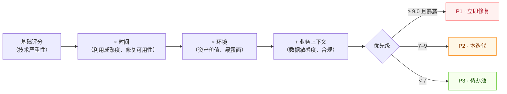

# 风险评估

本指南演示使用 CVSS Skills 进行全面风险评估的方法，包括漏洞优先级排序、风险评分和企业风险管理框架。

## 从 CVSS 评分到业务风险

原始的 CVSS 基础评分只是起点。时间与环境指标对其修正，再结合业务上下文，才能转化为有优先级的行动：



## 概述

使用 CVSS 进行风险评估包括：

- 漏洞影响分析
- 威胁环境评估
- 业务上下文集成
- 风险评分和优先级排序
- 缓解策略制定
- 合规性和报告

## 风险评估框架

### 风险组件

```go
type RiskAssessment struct {
    Vulnerability    *Vulnerability    `json:"vulnerability"`
    ThreatContext    *ThreatContext    `json:"threat_context"`
    BusinessImpact   *BusinessImpact   `json:"business_impact"`
    RiskScore        float64           `json:"risk_score"`
    RiskLevel        string            `json:"risk_level"`
    Recommendations  []Recommendation  `json:"recommendations"`
    Timeline         *Timeline         `json:"timeline"`
}

type Vulnerability struct {
    ID              string    `json:"id"`
    CVSSVector      string    `json:"cvss_vector"`
    BaseScore       float64   `json:"base_score"`
    TemporalScore   float64   `json:"temporal_score"`
    EnvironmentalScore float64 `json:"environmental_score"`
    Severity        string    `json:"severity"`
    Description     string    `json:"description"`
    AffectedSystems []string  `json:"affected_systems"`
}

type ThreatContext struct {
    ExploitAvailable    bool      `json:"exploit_available"`
    ExploitMaturity     string    `json:"exploit_maturity"`
    ThreatActors        []string  `json:"threat_actors"`
    AttackComplexity    string    `json:"attack_complexity"`
    ExposureLevel       string    `json:"exposure_level"`
    GeographicRelevance []string  `json:"geographic_relevance"`
}

type BusinessImpact struct {
    CriticalityLevel    string    `json:"criticality_level"`
    DataSensitivity     string    `json:"data_sensitivity"`
    SystemImportance    string    `json:"system_importance"`
    ComplianceImpact    []string  `json:"compliance_impact"`
    FinancialImpact     float64   `json:"financial_impact"`
    ReputationalImpact  string    `json:"reputational_impact"`
}
```

### 风险计算器

```go
type RiskCalculator struct {
    weights RiskWeights
    config  RiskConfig
}

type RiskWeights struct {
    CVSSBase        float64 `json:"cvss_base"`
    CVSSTemporal    float64 `json:"cvss_temporal"`
    CVSSEnvironmental float64 `json:"cvss_environmental"`
    ThreatContext   float64 `json:"threat_context"`
    BusinessImpact  float64 `json:"business_impact"`
}

type RiskConfig struct {
    Industry        string            `json:"industry"`
    Organization    string            `json:"organization"`
    RiskTolerance   string            `json:"risk_tolerance"`
    ComplianceReqs  []string          `json:"compliance_requirements"`
    CustomFactors   map[string]float64 `json:"custom_factors"`
}

func NewRiskCalculator(config RiskConfig) *RiskCalculator {
    // 平衡风险评估的默认权重
    weights := RiskWeights{
        CVSSBase:          0.4,
        CVSSTemporal:      0.2,
        CVSSEnvironmental: 0.2,
        ThreatContext:     0.1,
        BusinessImpact:    0.1,
    }
    
    // 根据行业调整权重
    switch config.Industry {
    case "financial":
        weights.BusinessImpact = 0.25
        weights.CVSSEnvironmental = 0.25
    case "healthcare":
        weights.BusinessImpact = 0.3
        weights.CVSSBase = 0.3
    case "government":
        weights.ThreatContext = 0.2
        weights.CVSSEnvironmental = 0.3
    }
    
    return &RiskCalculator{
        weights: weights,
        config:  config,
    }
}

func (rc *RiskCalculator) CalculateRisk(vuln *Vulnerability, threat *ThreatContext, business *BusinessImpact) *RiskAssessment {
    // 计算加权风险分数
    riskScore := rc.calculateWeightedScore(vuln, threat, business)
    
    // 确定风险级别
    riskLevel := rc.determineRiskLevel(riskScore)
    
    // 生成建议
    recommendations := rc.generateRecommendations(vuln, threat, business, riskScore)
    
    // 创建时间线
    timeline := rc.createTimeline(riskLevel, vuln.Severity)
    
    return &RiskAssessment{
        Vulnerability:   vuln,
        ThreatContext:   threat,
        BusinessImpact:  business,
        RiskScore:       riskScore,
        RiskLevel:       riskLevel,
        Recommendations: recommendations,
        Timeline:        timeline,
    }
}
```

## 漏洞优先级排序

### 优先级矩阵

```go
type VulnerabilityPriority struct {
    Vulnerability *Vulnerability `json:"vulnerability"`
    Priority      int           `json:"priority"`
    Urgency       string        `json:"urgency"`
    Impact        string        `json:"impact"`
    Effort        string        `json:"effort"`
    ROI           float64       `json:"roi"`
}

func PrioritizeVulnerabilities(vulnerabilities []*Vulnerability, context *OrganizationContext) []*VulnerabilityPriority {
    priorities := make([]*VulnerabilityPriority, len(vulnerabilities))
    
    for i, vuln := range vulnerabilities {
        priority := &VulnerabilityPriority{
            Vulnerability: vuln,
            Urgency:       calculateUrgency(vuln),
            Impact:        calculateImpact(vuln, context),
            Effort:        estimateEffort(vuln, context),
        }
        
        priority.Priority = calculatePriorityScore(priority)
        priority.ROI = calculateROI(priority)
        priorities[i] = priority
    }
    
    // 按优先级排序（最高优先级在前）
    sort.Slice(priorities, func(i, j int) bool {
        return priorities[i].Priority > priorities[j].Priority
    })
    
    return priorities
}

func calculateUrgency(vuln *Vulnerability) string {
    if vuln.BaseScore >= 9.0 {
        return "严重"
    } else if vuln.BaseScore >= 7.0 {
        return "高"
    } else if vuln.BaseScore >= 4.0 {
        return "中等"
    }
    return "低"
}

func calculateImpact(vuln *Vulnerability, context *OrganizationContext) string {
    impactScore := 0
    
    // 检查漏洞是否影响关键系统
    for _, system := range vuln.AffectedSystems {
        if contains(context.CriticalSystems, system) {
            impactScore += 3
        } else if contains(context.ImportantSystems, system) {
            impactScore += 2
        } else {
            impactScore += 1
        }
    }
    
    // 考虑数据敏感性
    if vuln.BaseScore >= 7.0 && impactScore >= 3 {
        return "严重"
    } else if vuln.BaseScore >= 4.0 && impactScore >= 2 {
        return "高"
    } else if impactScore >= 1 {
        return "中等"
    }
    return "低"
}
```

## 风险报告

### 执行仪表板

```go
type RiskDashboard struct {
    Summary          *RiskSummary          `json:"summary"`
    TrendAnalysis    *TrendAnalysis        `json:"trend_analysis"`
    TopRisks         []*RiskAssessment     `json:"top_risks"`
    ComplianceStatus *ComplianceStatus     `json:"compliance_status"`
    Recommendations  []*ActionItem         `json:"recommendations"`
    Metrics          *RiskMetrics          `json:"metrics"`
}

type RiskSummary struct {
    TotalVulnerabilities int                    `json:"total_vulnerabilities"`
    RiskDistribution     map[string]int         `json:"risk_distribution"`
    AverageRiskScore     float64                `json:"average_risk_score"`
    TrendDirection       string                 `json:"trend_direction"`
    LastUpdated          time.Time              `json:"last_updated"`
}

type TrendAnalysis struct {
    TimeRange        string                     `json:"time_range"`
    RiskTrend        []RiskDataPoint           `json:"risk_trend"`
    VulnerabilityTrend []VulnerabilityDataPoint `json:"vulnerability_trend"`
    Predictions      *RiskPrediction           `json:"predictions"`
}

func GenerateRiskDashboard(assessments []*RiskAssessment, timeRange string) *RiskDashboard {
    dashboard := &RiskDashboard{
        Summary:          generateRiskSummary(assessments),
        TrendAnalysis:    analyzeTrends(assessments, timeRange),
        TopRisks:         getTopRisks(assessments, 10),
        ComplianceStatus: assessCompliance(assessments),
        Recommendations:  generateActionItems(assessments),
        Metrics:          calculateRiskMetrics(assessments),
    }
    
    return dashboard
}
```

## 行业特定风险评估

### 金融服务

```go
func AssessFinancialRisk(vuln *Vulnerability) *FinancialRiskAssessment {
    assessment := &FinancialRiskAssessment{
        BaseAssessment: calculateBaseRisk(vuln),
    }
    
    // 金融特定因素
    if affectsPaymentSystems(vuln) {
        assessment.RegulatoryImpact = "高"
        assessment.FinancialLoss = estimateFinancialLoss(vuln, "payment")
    }
    
    if affectsCustomerData(vuln) {
        assessment.ComplianceRisk = []string{"PCI-DSS", "SOX", "GDPR"}
        assessment.ReputationalRisk = "严重"
    }
    
    // 计算调整后的风险分数
    assessment.AdjustedRiskScore = applyFinancialWeights(assessment)
    
    return assessment
}

type FinancialRiskAssessment struct {
    BaseAssessment     *RiskAssessment `json:"base_assessment"`
    RegulatoryImpact   string          `json:"regulatory_impact"`
    ComplianceRisk     []string        `json:"compliance_risk"`
    FinancialLoss      float64         `json:"financial_loss"`
    ReputationalRisk   string          `json:"reputational_risk"`
    AdjustedRiskScore  float64         `json:"adjusted_risk_score"`
}
```

### 医疗保健

```go
func AssessHealthcareRisk(vuln *Vulnerability) *HealthcareRiskAssessment {
    assessment := &HealthcareRiskAssessment{
        BaseAssessment: calculateBaseRisk(vuln),
    }
    
    // 医疗保健特定因素
    if affectsPatientData(vuln) {
        assessment.HIPAAImpact = "严重"
        assessment.PatientSafety = assessPatientSafetyRisk(vuln)
    }
    
    if affectsMedicalDevices(vuln) {
        assessment.FDACompliance = "必需"
        assessment.ClinicalImpact = "高"
    }
    
    // 计算调整后的风险分数
    assessment.AdjustedRiskScore = applyHealthcareWeights(assessment)
    
    return assessment
}

type HealthcareRiskAssessment struct {
    BaseAssessment     *RiskAssessment `json:"base_assessment"`
    HIPAAImpact        string          `json:"hipaa_impact"`
    PatientSafety      string          `json:"patient_safety"`
    FDACompliance      string          `json:"fda_compliance"`
    ClinicalImpact     string          `json:"clinical_impact"`
    AdjustedRiskScore  float64         `json:"adjusted_risk_score"`
}
```

## 风险缓解策略

### 缓解计划

```go
type MitigationPlan struct {
    VulnerabilityID   string              `json:"vulnerability_id"`
    RiskLevel         string              `json:"risk_level"`
    Strategies        []MitigationStrategy `json:"strategies"`
    Timeline          *MitigationTimeline `json:"timeline"`
    Resources         *ResourceRequirements `json:"resources"`
    Success           *SuccessMetrics     `json:"success_metrics"`
}

type MitigationStrategy struct {
    Type          string    `json:"type"`
    Description   string    `json:"description"`
    Effectiveness float64   `json:"effectiveness"`
    Cost          float64   `json:"cost"`
    Complexity    string    `json:"complexity"`
    Dependencies  []string  `json:"dependencies"`
}

func GenerateMitigationPlan(assessment *RiskAssessment) *MitigationPlan {
    strategies := []MitigationStrategy{}
    
    // 补丁管理
    if isPatchable(assessment.Vulnerability) {
        strategies = append(strategies, MitigationStrategy{
            Type:          "补丁",
            Description:   "应用供应商安全补丁",
            Effectiveness: 0.95,
            Cost:          calculatePatchCost(assessment.Vulnerability),
            Complexity:    "低",
            Dependencies:  []string{"变更管理", "测试"},
        })
    }
    
    // 配置更改
    if hasConfigFix(assessment.Vulnerability) {
        strategies = append(strategies, MitigationStrategy{
            Type:          "配置",
            Description:   "实施安全配置",
            Effectiveness: 0.8,
            Cost:          100,
            Complexity:    "中等",
            Dependencies:  []string{"系统管理"},
        })
    }
    
    // 补偿控制
    strategies = append(strategies, generateCompensatingControls(assessment)...)
    
    return &MitigationPlan{
        VulnerabilityID: assessment.Vulnerability.ID,
        RiskLevel:       assessment.RiskLevel,
        Strategies:      strategies,
        Timeline:        createMitigationTimeline(assessment.RiskLevel),
        Resources:       calculateResourceRequirements(strategies),
        Success:         defineSucessMetrics(assessment),
    }
}
```

## 合规性集成

### 法规映射

```go
type ComplianceMapping struct {
    Framework     string            `json:"framework"`
    Requirements  []string          `json:"requirements"`
    Controls      []string          `json:"controls"`
    RiskLevel     string            `json:"risk_level"`
    Gaps          []ComplianceGap   `json:"gaps"`
}

type ComplianceGap struct {
    Requirement string `json:"requirement"`
    Current     string `json:"current_state"`
    Required    string `json:"required_state"`
    Gap         string `json:"gap_description"`
    Priority    string `json:"priority"`
}

func MapToCompliance(assessment *RiskAssessment, frameworks []string) []ComplianceMapping {
    mappings := []ComplianceMapping{}
    
    for _, framework := range frameworks {
        mapping := ComplianceMapping{
            Framework: framework,
        }
        
        switch framework {
        case "NIST":
            mapping = mapToNIST(assessment)
        case "ISO27001":
            mapping = mapToISO27001(assessment)
        case "PCI-DSS":
            mapping = mapToPCIDSS(assessment)
        case "SOC2":
            mapping = mapToSOC2(assessment)
        }
        
        mappings = append(mappings, mapping)
    }
    
    return mappings
}
```

## 测试和验证

### 风险评估测试

```go
func TestRiskAssessment(t *testing.T) {
    testCases := []struct {
        name           string
        vulnerability  *Vulnerability
        expectedRisk   string
        expectedScore  float64
    }{
        {
            name: "生产环境中的严重漏洞",
            vulnerability: &Vulnerability{
                CVSSVector: "CVSS:3.1/AV:N/AC:L/PR:N/UI:N/S:U/C:H/I:H/A:H",
                BaseScore:  9.8,
                AffectedSystems: []string{"production-web", "database"},
            },
            expectedRisk:  "严重",
            expectedScore: 9.5,
        },
        {
            name: "开发环境中的中等漏洞",
            vulnerability: &Vulnerability{
                CVSSVector: "CVSS:3.1/AV:L/AC:H/PR:H/UI:R/S:U/C:L/I:L/A:L",
                BaseScore:  3.8,
                AffectedSystems: []string{"dev-environment"},
            },
            expectedRisk:  "低",
            expectedScore: 2.5,
        },
    }
    
    calculator := NewRiskCalculator(RiskConfig{
        Industry: "technology",
        RiskTolerance: "medium",
    })
    
    for _, tc := range testCases {
        t.Run(tc.name, func(t *testing.T) {
            threat := &ThreatContext{
                ExploitAvailable: true,
                ExploitMaturity:  "功能性",
            }
            
            business := &BusinessImpact{
                CriticalityLevel: "高",
                DataSensitivity:  "机密",
            }
            
            assessment := calculator.CalculateRisk(tc.vulnerability, threat, business)
            
            assert.Equal(t, tc.expectedRisk, assessment.RiskLevel)
            assert.InDelta(t, tc.expectedScore, assessment.RiskScore, 0.5)
        })
    }
}
```

## 下一步

实施风险评估后，探索：

- [风险管理](/zh/examples/risk-management) - 持续风险管理流程
- [合规自动化](/zh/examples/compliance) - 自动化合规报告
- [安全指标](/zh/examples/security-metrics) - 高级安全测量

## 相关文档

- [严重性分类](/zh/examples/severity) - 理解 CVSS 严重性
- [环境指标](/zh/examples/environmental) - 环境分数计算
- [时间指标](/zh/examples/temporal) - 时间分数分析
