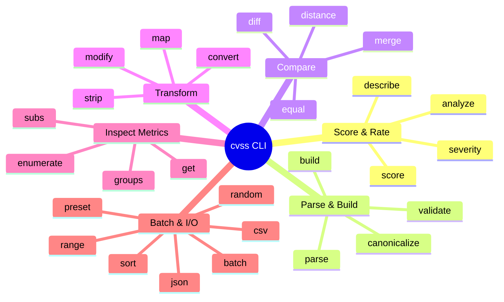
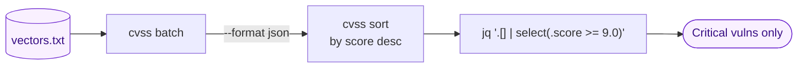

# CLI Reference

The `cvss` CLI provides **30+ commands** for parsing, scoring, validating, comparing, and analyzing CVSS vectors. Every command supports `--format json` for structured output.

## Installation

::: code-group

```bash [curl (pre-built binary)]
curl -sL https://github.com/scagogogo/cvss-skills/releases/latest/download/cvss-skills_$(uname -s | tr A-Z a-z)_$(uname -m).tar.gz | tar xz
sudo mv cvss /usr/local/bin/
```

```bash [go install]
go install github.com/scagogogo/cvss-skills/cmd/cvss-cli@latest
```

:::

Pre-built binaries cover **6 operating systems × 8 architectures** — see [Downloads](/downloads/).

## Command Map

The 30+ commands fall into six functional groups:



## Commands

| Command             | Description                  | Example                                                                  |
| ------------------- | ---------------------------- | ------------------------------------------------------------------------ |
| `cvss score`        | Calculate CVSS scores        | `cvss score "CVSS:3.1/AV:N/AC:L/PR:N/UI:N/S:U/C:H/I:H/A:H"`             |
| `cvss parse`        | Parse a vector string        | `cvss parse "CVSS:3.1/AV:N/AC:L/PR:N/UI:N/S:U/C:H/I:H/A:H"`             |
| `cvss validate`     | Validate a vector string     | `cvss validate "CVSS:3.1/AV:N/AC:L/PR:N/UI:N/S:U/C:H/I:H/A:H"`          |
| `cvss build`        | Build from metric flags      | `cvss build --av N --ac L --pr N --ui N --s U --c H --i H --a H`        |
| `cvss describe`     | Human-readable description   | `cvss describe "CVSS:3.1/AV:N/AC:L/PR:N/UI:N/S:U/C:H/I:H/A:H"`          |
| `cvss diff`         | Compare two vectors          | `cvss diff "CVSS:3.1/..." "CVSS:3.1/..."`                              |
| `cvss merge`        | Merge two vectors            | `cvss merge "CVSS:3.1/..." "CVSS:3.1/..."`                             |
| `cvss distance`     | Calculate distance metrics   | `cvss distance "CVSS:3.1/..." "CVSS:3.1/..."`                          |
| `cvss analyze`      | Impact/sensitivity analysis  | `cvss analyze "CVSS:3.1/..."`                                          |
| `cvss range`        | Score range for partials     | `cvss range "CVSS:3.1/AV:N"`                                           |
| `cvss preset`       | Generate preset vectors      | `cvss preset critical-network`                                         |
| `cvss random`       | Generate random vectors      | `cvss random --version 3.1`                                            |
| `cvss json`         | JSON serialization           | `cvss json "CVSS:3.1/..."`                                             |
| `cvss csv`          | CSV file I/O                 | `cvss csv input.csv --output results.csv`                              |
| `cvss batch`        | Batch operations             | `cvss batch --file vectors.txt`                                        |
| `cvss severity`     | Get severity rating          | `cvss severity "CVSS:3.1/..."`                                         |
| `cvss sort`         | Sort vectors by score        | `cvss sort file.csv`                                                   |
| `cvss canonicalize` | Canonicalize vector format   | `cvss canonicalize "CVSS:3.1/..."`                                     |
| `cvss convert`      | Convert between versions     | `cvss convert "CVSS:3.0/..." --to 3.1`                                 |
| `cvss enumerate`    | Enumerate metric values      | `cvss enumerate AV`                                                    |
| `cvss equal`        | Compare two vectors          | `cvss equal "CVSS:3.1/..." "CVSS:3.1/..."`                             |
| `cvss get`          | Get specific metric value    | `cvss get AV "CVSS:3.1/..."`                                           |
| `cvss groups`       | Show metric groups           | `cvss groups`                                                          |
| `cvss map`          | Map/transform vectors        | `cvss map --preset high-severity`                                      |
| `cvss modify`       | Modify a metric value        | `cvss modify AV L "CVSS:3.1/..."`                                      |
| `cvss strip`        | Strip temporal/env metrics   | `cvss strip "CVSS:3.1/..."`                                            |
| `cvss subs`         | Show metric substitutions    | `cvss subs`                                                            |

Run `cvss --help` for the full list and `cvss <command> --help` for per-command options.

## JSON Output

Every command accepts `--format json` for machine-readable output — ideal for piping into `jq` or other tools:

```bash
cvss score "CVSS:3.1/AV:N/AC:L/PR:N/UI:N/S:U/C:H/I:H/A:H" --format json | jq .score
```

### Composing commands in a pipeline

Because every command reads a vector and writes JSON, commands chain cleanly for batch triage:


