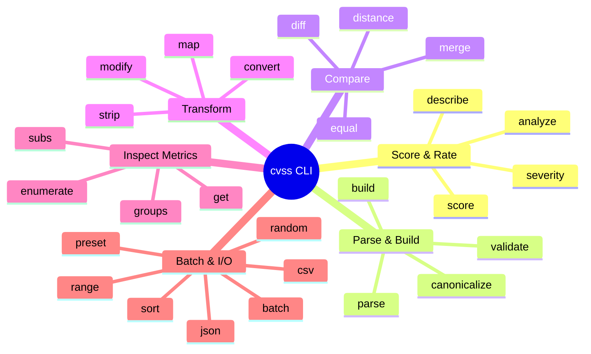
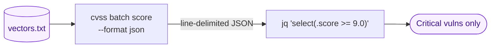

# CLI Reference

The `cvss` CLI provides **30+ commands** for parsing, scoring, validating, comparing, and analyzing CVSS vectors. Every command supports `--format json` for structured output.

## Installation

::: code-group

```bash [curl (pre-built binary)]
os=$(uname -s | tr '[:upper:]' '[:lower:]'); arch=$(uname -m)
case "$arch" in arm64) arch=aarch64 ;; amd64) arch=x86_64 ;; esac
ver=$(curl -sL https://api.github.com/repos/scagogogo/cvss-skills/releases/latest | sed -nE 's/.*"tag_name":\s*"v?([^"]+)".*/\1/p')
curl -sL "https://github.com/scagogogo/cvss-skills/releases/download/v${ver}/cvss-skills_${ver}_${os}_${arch}.tar.gz" | tar xz
sudo mv cvss /usr/local/bin/
```

```bash [go install]
go install github.com/scagogogo/cvss-skills/cmd/cvss-cli@latest
```

:::

Pre-built binaries cover **6 operating systems** (33 archive packages) — see [Downloads](/downloads/).

## Command Map

The 30+ commands fall into six functional groups:



## Commands

| Command             | Description                  | Example                                                                  |
| ------------------- | ---------------------------- | ------------------------------------------------------------------------ |
| `cvss score`        | Calculate CVSS scores        | `cvss score "CVSS:3.1/AV:N/AC:L/PR:N/UI:N/S:U/C:H/I:H/A:H"`             |
| `cvss parse`        | Parse a vector string        | `cvss parse "CVSS:3.1/AV:N/AC:L/PR:N/UI:N/S:U/C:H/I:H/A:H"`             |
| `cvss validate`     | Validate a vector string     | `cvss validate "CVSS:3.1/AV:N/AC:L/PR:N/UI:N/S:U/C:H/I:H/A:H"`          |
| `cvss build`        | Build from metric flags      | `cvss build --AV N --AC L --PR N --UI N --S U --C H --I H --A H`        |
| `cvss describe`     | Human-readable description   | `cvss describe "CVSS:3.1/AV:N/AC:L/PR:N/UI:N/S:U/C:H/I:H/A:H"`          |
| `cvss diff`         | Compare two vectors          | `cvss diff "CVSS:3.1/..." "CVSS:3.1/..."`                              |
| `cvss merge`        | Merge two vectors            | `cvss merge "CVSS:3.1/..." "CVSS:3.1/..."`                             |
| `cvss distance`     | Calculate distance metrics   | `cvss distance "CVSS:3.1/..." "CVSS:3.1/..."`                          |
| `cvss analyze`      | Impact/sensitivity analysis  | `cvss analyze "CVSS:3.1/..."`                                          |
| `cvss range`        | Score range for partials     | `cvss range "CVSS:3.1/AV:N"`                                           |
| `cvss preset`       | Generate preset vectors      | `cvss preset critical`                                                 |
| `cvss random`       | Generate random vectors      | `cvss random --cvss-version 3.1`                                       |
| `cvss json`         | JSON serialization           | `cvss json "CVSS:3.1/..."`                                             |
| `cvss csv`          | CSV read/write (subcommands) | `cvss csv read input.csv`                                              |
| `cvss batch`        | Batch score/validate (subcmd)| `cvss batch score vectors.txt`                                         |
| `cvss severity`     | Severity rating from a score | `cvss severity 9.8`                                                    |
| `cvss sort`         | Sort vectors by score        | `cvss sort file.csv`                                                   |
| `cvss canonicalize` | Canonicalize vector format   | `cvss canonicalize "CVSS:3.1/..."`                                     |
| `cvss convert`      | Convert between versions     | `cvss convert "CVSS:3.0/..." --to 3.1`                                 |
| `cvss enumerate`    | List a metric's valid values | `cvss enumerate --metric AV`                                           |
| `cvss equal`        | Compare two vectors          | `cvss equal "CVSS:3.1/..." "CVSS:3.1/..."`                             |
| `cvss get`          | Get one metric's value       | `cvss get "CVSS:3.1/..." AV`                                           |
| `cvss groups`       | Show metrics by group        | `cvss groups "CVSS:3.1/..."`                                           |
| `cvss map`          | Output vector as key=value   | `cvss map "CVSS:3.1/..."`                                              |
| `cvss modify`       | Modify metrics (via flags)   | `cvss modify "CVSS:3.1/..." --AV L`                                    |
| `cvss strip`        | Strip temporal/env metrics   | `cvss strip "CVSS:3.1/..."`                                            |
| `cvss subs`         | Show Impact/Exploitability   | `cvss subs "CVSS:3.1/..."`                                             |

Run `cvss --help` for the full list and `cvss <command> --help` for per-command options.

## JSON Output

Every command accepts `--format json` for machine-readable output — ideal for piping into `jq` or other tools:

```bash
cvss score "CVSS:3.1/AV:N/AC:L/PR:N/UI:N/S:U/C:H/I:H/A:H" --format json | jq .score
```

::: tip Scripting contract
`--format json` is the stable, machine-readable interface — prefer it over parsing human output in scripts. Commands exit non-zero on parse/validation failure, so you can gate on `cvss validate "<vector>" && …` without inspecting stdout.
:::

### Composing commands in a pipeline

`--format json` makes commands emit line-delimited JSON objects, so `cvss batch` pipes cleanly into `jq` for batch triage:



```bash
cvss batch score --format json vectors.txt | jq 'select(.score >= 9.0)'
```

::: tip `cvss sort` reads vectors, not JSON
`cvss sort` takes a plain text file of vector strings (one per line) and prints `score  vector` lines — it does **not** consume `--format json` output. To rank vectors, feed it the raw text file: `cvss sort vectors.txt`.
:::
