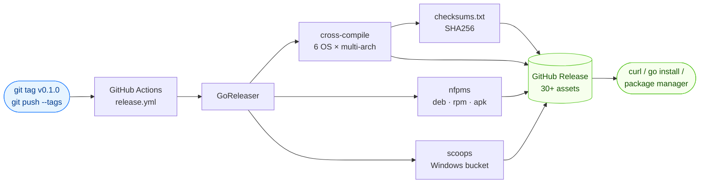

# Downloads

Pre-built binaries are published with every [GitHub Release](https://github.com/scagogogo/cvss-skills/releases). They cover **6 operating systems across many architectures** (30+ packages total), built by GoReleaser via GitHub Actions.

## How Releases Are Built

A pushed version tag triggers the entire release pipeline automatically — no manual uploads:



## One-Line Install (Linux / macOS)

Auto-detects your OS and architecture, resolves the latest release version, and normalizes `uname` output to match the archive naming convention:

```bash
os=$(uname -s | tr '[:upper:]' '[:lower:]')
arch=$(uname -m)
case "$arch" in
  arm64)  arch=aarch64 ;;   # macOS Apple Silicon reports arm64
  amd64)  arch=x86_64  ;;   # FreeBSD reports amd64
esac
ver=$(curl -sL https://api.github.com/repos/scagogogo/cvss-skills/releases/latest | sed -nE 's/.*"tag_name":\s*"v?([^"]+)".*/\1/p')
curl -sL "https://github.com/scagogogo/cvss-skills/releases/download/v${ver}/cvss-skills_${ver}_${os}_${arch}.tar.gz" | tar xz
sudo mv cvss /usr/local/bin/
```

::: warning Archive names include the version number
Release archives are named `cvss-skills_<version>_<os>_<arch>.tar.gz` (e.g. `cvss-skills_0.1.0_linux_x86_64.tar.gz`). The `releases/latest/download/<asset>` URL requires the **exact** asset name, so a versionless URL like `…/latest/download/cvss-skills_linux_x86_64.tar.gz` returns **404**. The snippet above resolves the latest version via the GitHub API first.
:::

::: warning Don't use a bare `uname -m` in the URL
The release archives use `x86_64` / `aarch64`, but `uname -m` reports **`arm64`** on Apple Silicon Macs and **`amd64`** on FreeBSD. Piping `uname -m` straight into the URL 404s on those platforms — the `case` block above normalizes it.
:::

### Architecture name aliases

The archive names use the following canonical arch labels. If you know your platform's Go arch (`GOARCH`) or `uname -m` output, map it here:

| Archive label | `GOARCH` | `uname -m` (typical)      |
| ------------- | -------- | ------------------------- |
| `x86_64`      | `amd64`  | `x86_64` (Linux/macOS), `amd64` (FreeBSD) |
| `aarch64`     | `arm64`  | `aarch64` (Linux), `arm64` (macOS) |
| `i386`        | `386`    | `i686` / `i386`           |
| `armv6/v7`    | `arm`    | `armv6l` / `armv7l`       |

## Install via Go

```bash
go install github.com/scagogogo/cvss-skills/cmd/cvss-cli@latest
```

::: tip Requires Go ≥ 1.18 and `$GOBIN` on your `PATH`
`go install` drops the `cvss-cli` binary into `$(go env GOBIN)` (or `$(go env GOPATH)/bin` if `GOBIN` is unset). Add that directory to your `PATH` if `cvss` isn't found afterward. Note the installed binary is named `cvss-cli`; symlink or rename it to `cvss` to match the examples: `ln -s "$(go env GOPATH)/bin/cvss-cli" /usr/local/bin/cvss`.
:::

## Build from Source

```bash
git clone https://github.com/scagogogo/cvss-skills.git
cd cvss-skills
go build -o cvss ./cmd/cvss-cli/
```

Or use the provided Makefile:

```bash
make build
```

## Pre-built Binary Matrix

Archive naming: `cvss-skills_<version>_<os>_<arch>[v<arm>].<tar.gz|zip>`

Replace `<version>` with a tag (e.g. `0.1.0`) — see [One-Line Install](#one-line-install-linux-macos) for a snippet that resolves the latest version automatically.

### Linux

| Arch      | Download                                                                                                                |
| --------- | ----------------------------------------------------------------------------------------------------------------------- |
| x86_64    | `cvss-skills_<version>_linux_x86_64.tar.gz`                                                                             |
| aarch64   | `cvss-skills_<version>_linux_aarch64.tar.gz`                                                                            |
| i386      | `cvss-skills_<version>_linux_i386.tar.gz`                                                                               |
| armv5     | `cvss-skills_<version>_linux_armv5.tar.gz`                                                                              |
| armv6     | `cvss-skills_<version>_linux_armv6.tar.gz`                                                                              |
| armv7     | `cvss-skills_<version>_linux_armv7.tar.gz`                                                                              |
| ppc64le   | `cvss-skills_<version>_linux_ppc64le.tar.gz`                                                                            |
| s390x     | `cvss-skills_<version>_linux_s390x.tar.gz`                                                                              |
| riscv64   | `cvss-skills_<version>_linux_riscv64.tar.gz`                                                                            |
| mips64le  | `cvss-skills_<version>_linux_mips64le.tar.gz`                                                                           |

### macOS (darwin)

| Arch    | Download                                                  |
| ------- | --------------------------------------------------------- |
| x86_64  | `cvss-skills_<version>_darwin_x86_64.tar.gz`              |
| aarch64 | `cvss-skills_<version>_darwin_aarch64.tar.gz`             |

### Windows

| Arch    | Download                                       |
| ------- | ---------------------------------------------- |
| x86_64  | `cvss-skills_<version>_windows_x86_64.zip`     |
| aarch64 | `cvss-skills_<version>_windows_aarch64.zip`    |
| i386    | `cvss-skills_<version>_windows_i386.zip`       |

### BSD (freebsd / netbsd / openbsd)

All three BSDs ship the same six architectures. The table below shows the FreeBSD names — swap `freebsd` for `netbsd` or `openbsd` to get the other two.

| Arch    | Download                                     |
| ------- | -------------------------------------------- |
| x86_64  | `cvss-skills_<version>_freebsd_x86_64.tar.gz`   |
| aarch64 | `cvss-skills_<version>_freebsd_aarch64.tar.gz`  |
| i386    | `cvss-skills_<version>_freebsd_i386.tar.gz`     |
| armv5   | `cvss-skills_<version>_freebsd_armv5.tar.gz`    |
| armv6   | `cvss-skills_<version>_freebsd_armv6.tar.gz`    |
| armv7   | `cvss-skills_<version>_freebsd_armv7.tar.gz`    |

## Full URL Template

For scripting, the canonical download URL is (replace `<version>`, e.g. `0.1.0`):

```
https://github.com/scagogogo/cvss-skills/releases/download/v<version>/cvss-skills_<version>_<os>_<arch>.<ext>
```

To always fetch the newest release without hard-coding a version, resolve it from the GitHub API first:

```bash
ver=$(curl -sL https://api.github.com/repos/scagogogo/cvss-skills/releases/latest | sed -nE 's/.*"tag_name":\s*"v?([^"]+)".*/\1/p')
```

## Verification

Every release ships a `checksums.txt` (SHA256). Verify a download:

```bash
curl -sL https://github.com/scagogogo/cvss-skills/releases/latest/download/checksums.txt | grep linux_x86_64
# →  <sha256>  cvss-skills_0.1.0_linux_x86_64.tar.gz
sha256sum cvss-skills_<version>_linux_x86_64.tar.gz
```

::: tip Compare the two hashes
The value printed by `sha256sum` must match the one in `checksums.txt` character-for-character. A mismatch means the download was corrupted or tampered with — delete it and re-download.
:::

::: details Windows / macOS checksum commands
On Windows PowerShell:

```powershell
Get-FileHash .\cvss-skills_<version>_windows_x86_64.zip -Algorithm SHA256
```

On macOS (uses `shasum` instead of `sha256sum`):

```bash
shasum -a 256 cvss-skills_<version>_darwin_aarch64.tar.gz
```
:::
