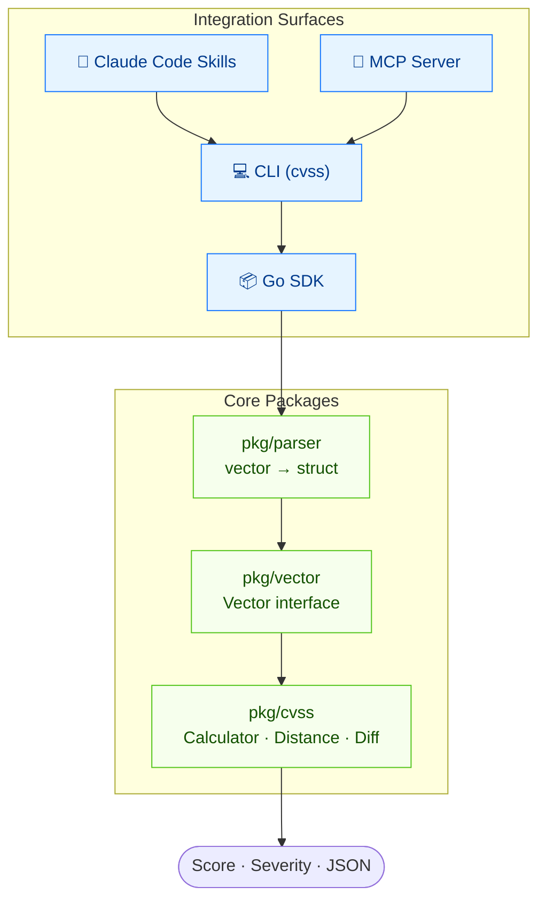
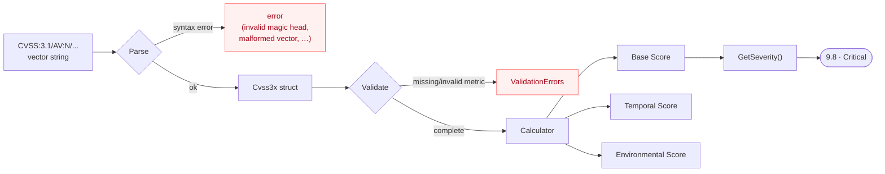
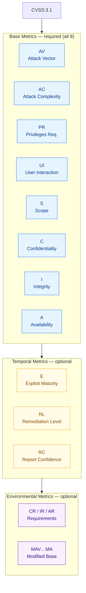
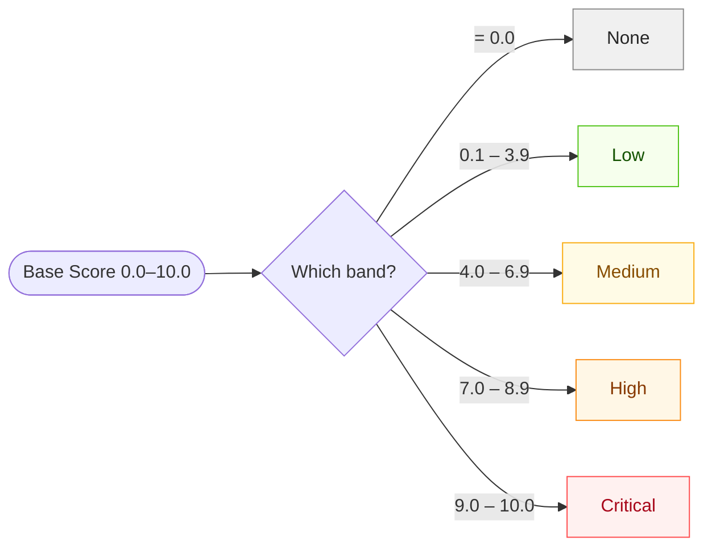

## What Problem Does This Solve?

CVSS is the industry standard for rating vulnerability severity, but working with vectors programmatically is painful — parsing is error-prone, scoring involves version-specific formulas, comparison is manual, and validation is scattered.

**CVSS Skills** solves all of this with a single, well-tested toolkit.


## Architecture at a Glance

Every integration method — Skills, Go SDK, CLI, and MCP — is a thin surface over the same well-tested core packages. Learn the model once; use it everywhere.



## From Vector String to Score

The canonical pipeline: a raw vector string is parsed into a typed struct, validated, then run through the version-aware calculator to produce a score and severity rating.



## CVSS Vector Structure

A CVSS vector consists of up to **3 layers** of metrics:




## Severity Scale


| Rating   | Score Range | Color   |
| -------- | ----------- | ------- |
| None     | 0.0         | Gray    |
| Low      | 0.1 – 3.9   | Green   |
| Medium   | 4.0 – 6.9   | Yellow  |
| High     | 7.0 – 8.9   | Orange  |
| Critical | 9.0 – 10.0  | Red     |

A numeric base score maps to exactly one rating band via `GetSeverity()`:



::: tip v3.0 vs v3.1 — the score can differ for the same vector
The band boundaries above are identical across versions, but the underlying formulas are not. CVSS v3.1 introduced a defined **roundup** function and re-weighted a few values (e.g. `UI:R` = 0.62 in v3.1 vs 0.56 in v3.0). The toolkit reads the `CVSS:3.0` / `CVSS:3.1` prefix and applies the matching formula automatically — so always keep the version prefix on your vectors.
:::

## Quick Start

::: code-group

```bash [Claude Code Skills]
claude mcp add --scope user cvss-skills -- https://github.com/scagogogo/cvss-skills
```

```bash [Go SDK]
go get github.com/scagogogo/cvss-skills@latest
```

```bash [CLI (curl)]
os=$(uname -s | tr '[:upper:]' '[:lower:]'); arch=$(uname -m)
case "$arch" in arm64) arch=aarch64 ;; amd64) arch=x86_64 ;; esac
ver=$(curl -sL https://api.github.com/repos/scagogogo/cvss-skills/releases/latest | sed -nE 's/.*"tag_name":\s*"v?([^"]+)".*/\1/p')
curl -sL "https://github.com/scagogogo/cvss-skills/releases/download/v${ver}/cvss-skills_${ver}_${os}_${arch}.tar.gz" | tar xz
sudo mv cvss /usr/local/bin/
```

```bash [CLI (go install)]
go install github.com/scagogogo/cvss-skills/cmd/cvss-cli@latest
```

:::

```bash
# Score a vector — works the same in every integration
cvss score "CVSS:3.1/AV:N/AC:L/PR:N/UI:N/S:U/C:H/I:H/A:H"
# Output: 9.8 (Critical)
```

## Next Steps

- [Integration Methods](/integration/) — compare Skills, Go SDK, CLI, and MCP, with a decision tree
- [CLI Reference](/cli/) — all 30+ commands with examples
- [Downloads](/downloads/) — pre-built binaries for every OS/arch, with checksum verification
- [API Docs](/docs/api/) — the complete Go SDK reference
