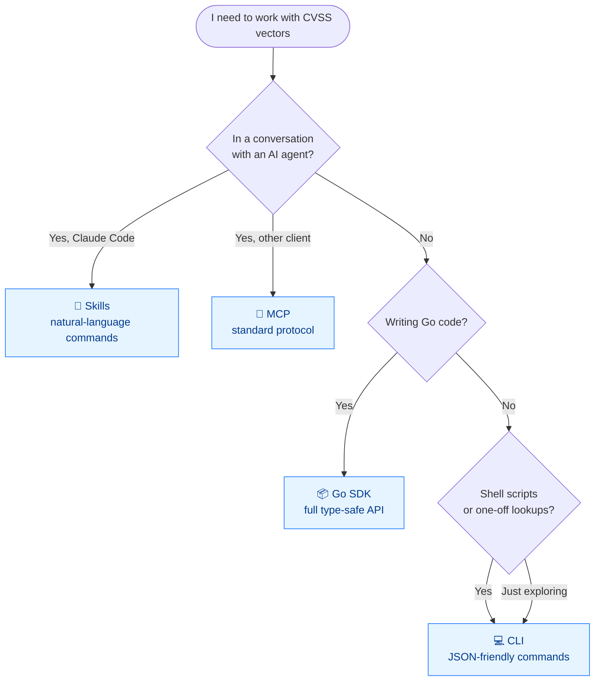
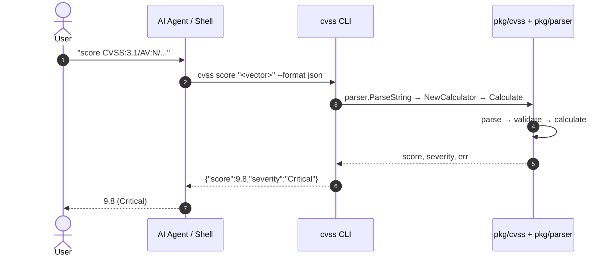

# Integration Methods

CVSS Skills is available through **four** integration methods. Pick the one that fits your workflow.


## Which Method Should I Use?



## How the Surfaces Relate

The CLI, Skills, and MCP surfaces all ultimately call the same Go core. Nothing re-implements scoring:



|          | Integration                | Best For                                    | Install                                                                     |
| -------- | -------------------------- | ------------------------------------------- | --------------------------------------------------------------------------- |
| 🤖       | **Skills** (Claude Code)   | Interactive analysis, natural language      | `claude mcp add --scope user cvss-skills -- https://github.com/scagogogo/cvss-skills` |
| 📦       | **Go SDK**                 | Building security tools & automation in Go | `go get github.com/scagogogo/cvss-skills@latest`                            |
| 💻       | **CLI**                    | Scripting, batch processing, quick lookups  | See [Downloads](/downloads/)                                               |
| 🔌       | **MCP**                    | AI agent integration via Model Context      | Add this repo as an MCP server from any MCP-compatible client               |

::: details When each surface fits — and when it doesn't
| Surface     | Reach for it when…                                              | Look elsewhere when…                                             |
| ----------- | -------------------------------------------------------------- | --------------------------------------------------------------- |
| **Skills**  | You're already in Claude Code and want natural-language analysis | You need reproducible output in a script → use the **CLI**      |
| **Go SDK**  | You're building a Go service and want compile-time type safety  | You're not writing Go → use the **CLI** or **MCP**              |
| **CLI**     | You want pipeable, JSON-emitting commands in shell or CI         | You need in-process access to intermediate structs → **Go SDK** |
| **MCP**     | Your agent (Claude Desktop, Continue, custom) speaks MCP         | You're in Claude Code specifically → **Skills** is more direct  |

All four share the same scoring core, so results are identical across surfaces — the choice is purely about ergonomics.
:::

## 1. Claude Code Skills

Once the repo is added as a skill source, Claude Code can invoke **9 CVSS skills** by name:

| Skill               | Description                                  |
| ------------------- | -------------------------------------------- |
| `cvss-parse`        | Parse CVSS v3.0/v3.1 vector strings          |
| `cvss-score`        | Calculate base/temporal/environmental scores |
| `cvss-validate`     | Validate vector completeness and correctness |
| `cvss-construct`    | Build vectors with the Builder API           |
| `cvss-compare`      | Diff, merge, and distance calculations       |
| `cvss-metrics`      | Enumerate and inspect metric definitions     |
| `cvss-serialize`    | JSON/text serialization and deserialization  |
| `cvss-advanced`     | Sensitivity analysis, score ranges, presets |
| `cvss-install`      | Install CLI tool and Go SDK dependency       |

Each skill is a markdown instruction file under `.claude/skills/` that tells Claude which `cvss` CLI command to run and how to interpret its output — so ask in natural language ("score this vector: …") and Claude picks the right skill automatically.

::: details Manual installation
Add to your project's `.claude/settings.json` or `~/.claude/settings.json`:

```json
{
  "mcpServers": {
    "cvss-skills": {
      "type": "github",
      "url": "https://github.com/scagogogo/cvss-skills"
    }
  }
}
```

:::

## 2. Go SDK

```go
package main

import (
    "fmt"
    "log"

    "github.com/scagogogo/cvss-skills/pkg/cvss"
    "github.com/scagogogo/cvss-skills/pkg/parser"
)

func main() {
    // One-step parse and score
    cv, score, severity, err := parser.ParseAndScore(
        "CVSS:3.1/AV:N/AC:L/PR:N/UI:N/S:U/C:H/I:H/A:H",
    )
    if err != nil {
        log.Fatal(err)
    }
    fmt.Printf("Score: %.1f (%s)\n", score, severity) // Score: 9.8 (Critical)
    _ = cv
}
```

Full API reference: [API Docs](/docs/api/).

::: tip Prefer `ParseAndScore` for the common path
`parser.ParseAndScore` collapses parse → validate → calculate into one call. Drop down to `parser.ParseString` + `cvss.NewCalculator` only when you need the intermediate `Cvss3x` struct (e.g. to inspect individual metrics or diff two vectors).
:::

## 3. CLI

```bash
cvss score "CVSS:3.1/AV:N/AC:L/PR:N/UI:N/S:U/C:H/I:H/A:H"
# Output: 9.8 (Critical)
```

See the [CLI Reference](/cli/) for all 30+ commands.

## 4. MCP

Connect this repository as an MCP server from any MCP-compatible client (Claude Desktop, Continue, custom agents) to use CVSS tools through the standard Model Context Protocol.
