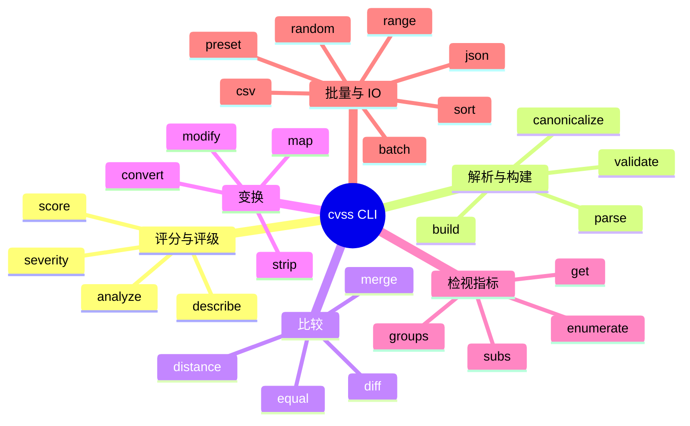
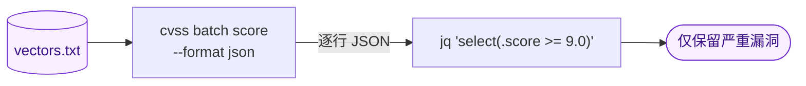

# 命令行参考

`cvss` CLI 提供 **30+ 命令**，用于解析、评分、校验、比较与分析 CVSS 向量。每条命令均支持 `--format json` 以输出结构化数据。

## 安装

::: code-group

```bash [curl（预编译二进制）]
os=$(uname -s | tr '[:upper:]' '[:lower:]'); arch=$(uname -m)
case "$arch" in arm64) arch=aarch64 ;; amd64) arch=x86_64 ;; esac
curl -sL "https://github.com/scagogogo/cvss-skills/releases/latest/download/cvss-skills_${os}_${arch}.tar.gz" | tar xz
sudo mv cvss /usr/local/bin/
```

```bash [go install]
go install github.com/scagogogo/cvss-skills/cmd/cvss-cli@latest
```

:::

预编译二进制覆盖 **6 个操作系统**（共 33 个归档包）—— 见[下载](/zh/downloads/)。

## 命令地图

30+ 命令可归为六大功能组：



## 命令

| 命令                | 描述                 | 示例                                                                     |
| ------------------- | -------------------- | ------------------------------------------------------------------------ |
| `cvss score`        | 计算 CVSS 评分       | `cvss score "CVSS:3.1/AV:N/AC:L/PR:N/UI:N/S:U/C:H/I:H/A:H"`             |
| `cvss parse`        | 解析向量字符串       | `cvss parse "CVSS:3.1/AV:N/AC:L/PR:N/UI:N/S:U/C:H/I:H/A:H"`             |
| `cvss validate`     | 校验向量字符串       | `cvss validate "CVSS:3.1/AV:N/AC:L/PR:N/UI:N/S:U/C:H/I:H/A:H"`          |
| `cvss build`        | 从指标标志构建       | `cvss build --AV N --AC L --PR N --UI N --S U --C H --I H --A H`        |
| `cvss describe`     | 人类可读描述         | `cvss describe "CVSS:3.1/AV:N/AC:L/PR:N/UI:N/S:U/C:H/I:H/A:H"`          |
| `cvss diff`         | 比较两个向量         | `cvss diff "CVSS:3.1/..." "CVSS:3.1/..."`                              |
| `cvss merge`        | 合并两个向量         | `cvss merge "CVSS:3.1/..." "CVSS:3.1/..."`                             |
| `cvss distance`     | 计算距离度量         | `cvss distance "CVSS:3.1/..." "CVSS:3.1/..."`                          |
| `cvss analyze`      | 影响/敏感性分析      | `cvss analyze "CVSS:3.1/..."`                                          |
| `cvss range`        | 部分向量的分数范围   | `cvss range "CVSS:3.1/AV:N"`                                           |
| `cvss preset`       | 生成预设向量         | `cvss preset critical`                                                 |
| `cvss random`       | 生成随机向量         | `cvss random --cvss-version 3.1`                                       |
| `cvss json`         | JSON 序列化          | `cvss json "CVSS:3.1/..."`                                             |
| `cvss csv`          | CSV 读写（子命令）   | `cvss csv read input.csv`                                              |
| `cvss batch`        | 批量评分/校验（子命令）| `cvss batch score vectors.txt`                                        |
| `cvss severity`     | 由分数得严重性等级   | `cvss severity 9.8`                                                    |
| `cvss sort`         | 按分数排序向量       | `cvss sort file.csv`                                                   |
| `cvss canonicalize` | 规范化向量格式       | `cvss canonicalize "CVSS:3.1/..."`                                     |
| `cvss convert`      | 版本间转换           | `cvss convert "CVSS:3.0/..." --to 3.1`                                 |
| `cvss enumerate`    | 列出某指标的合法取值 | `cvss enumerate --metric AV`                                           |
| `cvss equal`        | 比较两个向量         | `cvss equal "CVSS:3.1/..." "CVSS:3.1/..."`                             |
| `cvss get`          | 获取单个指标值       | `cvss get "CVSS:3.1/..." AV`                                           |
| `cvss groups`       | 按分组显示指标       | `cvss groups "CVSS:3.1/..."`                                           |
| `cvss map`          | 输出向量为 key=value | `cvss map "CVSS:3.1/..."`                                              |
| `cvss modify`       | 修改指标（用标志）   | `cvss modify "CVSS:3.1/..." --AV L`                                    |
| `cvss strip`        | 剥离时间/环境指标    | `cvss strip "CVSS:3.1/..."`                                            |
| `cvss subs`         | 显示影响/可利用子分数| `cvss subs "CVSS:3.1/..."`                                             |

运行 `cvss --help` 查看完整列表，`cvss <命令> --help` 查看单命令选项。

## JSON 输出

每条命令接受 `--format json` 以输出机器可读结果 —— 适合通过管道传入 `jq` 等工具：

```bash
cvss score "CVSS:3.1/AV:N/AC:L/PR:N/UI:N/S:U/C:H/I:H/A:H" --format json | jq .score
```

::: tip 脚本化约定
`--format json` 是稳定、机器可读的接口 —— 在脚本中应优先使用它，而不要解析给人看的输出。命令在解析/校验失败时返回非零退出码，因此你可以直接用 `cvss validate "<向量>" && …` 做门控，无需检查 stdout。
:::

### 用管道组合命令

`--format json` 让命令逐行输出 JSON 对象，因此 `cvss batch` 可直接管道传入 `jq`，用于批量定级：



```bash
cvss batch score --format json vectors.txt | jq 'select(.score >= 9.0)'
```

::: tip `cvss sort` 读入的是向量，不是 JSON
`cvss sort` 接收纯文本向量文件（每行一个向量），输出 `评分  向量` 文本 —— 它**不**消费 `--format json` 的输出。要排序向量，请直接喂原始文本文件：`cvss sort vectors.txt`。
:::
