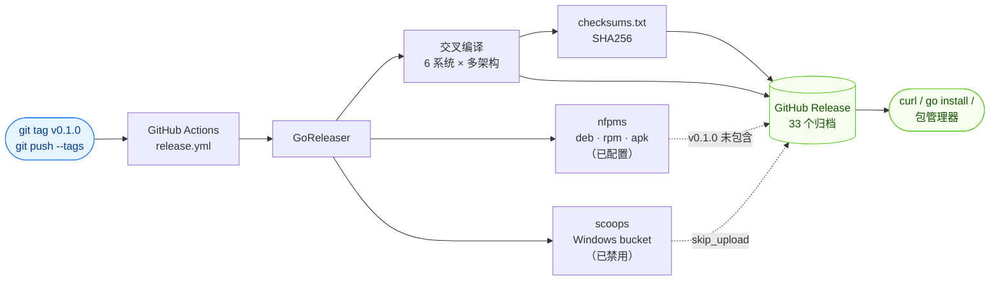

# 下载

每次 [GitHub Release](https://github.com/scagogogo/cvss-skills/releases) 均发布预编译二进制，覆盖 **6 系统、多架构**（共 30+ 个包），由 GoReleaser 经 GitHub Actions 构建。

## 发布是如何构建的

推送一个版本标签即自动触发整条发布流水线，无需手工上传：



## 一行安装（Linux / macOS）

自动检测系统与架构，解析最新发布版本，并把 `uname` 输出规范化为与归档命名一致的形式：

```bash
os=$(uname -s | tr '[:upper:]' '[:lower:]')
arch=$(uname -m)
case "$arch" in
  arm64)  arch=aarch64 ;;   # macOS Apple Silicon 报告 arm64
  amd64)  arch=x86_64  ;;   # FreeBSD 报告 amd64
esac
ver=$(curl -sL https://api.github.com/repos/scagogogo/cvss-skills/releases/latest | sed -nE 's/.*"tag_name":\s*"v?([^"]+)".*/\1/p')
curl -sL "https://github.com/scagogogo/cvss-skills/releases/download/v${ver}/cvss-skills_${ver}_${os}_${arch}.tar.gz" | tar xz
sudo mv cvss /usr/local/bin/
```

::: warning 归档名包含版本号
发布归档命名为 `cvss-skills_<版本>_<系统>_<架构>.tar.gz`（如 `cvss-skills_0.1.0_linux_x86_64.tar.gz`）。`releases/latest/download/<资产>` URL 要求**精确**的资产名，因此不含版本号的 URL（如 `…/latest/download/cvss-skills_linux_x86_64.tar.gz`）会返回 **404**。上面的脚本先通过 GitHub API 解析最新版本号。
:::

::: warning 不要把裸的 `uname -m` 直接拼进 URL
发布归档使用 `x86_64` / `aarch64`，但 `uname -m` 在 Apple Silicon Mac 上返回 **`arm64`**、在 FreeBSD 上返回 **`amd64`**。直接拼进 URL 会在这些平台上 404 —— 上面的 `case` 分支会做规范化。
:::

### 架构名称对照

归档名使用下列规范化的架构标签。若你只知道平台的 Go 架构（`GOARCH`）或 `uname -m` 输出，可据此对照：

| 归档标签   | `GOARCH` | `uname -m`（典型）        |
| ---------- | -------- | ------------------------- |
| `x86_64`   | `amd64`  | `x86_64`（Linux/macOS）、`amd64`（FreeBSD） |
| `aarch64`  | `arm64`  | `aarch64`（Linux）、`arm64`（macOS） |
| `i386`     | `386`    | `i686` / `i386`           |
| `armv5/v6/v7` | `arm`    | `armv5l` / `armv6l` / `armv7l`       |

## 通过 Go 安装

```bash
go install github.com/scagogogo/cvss-skills/cmd/cvss-cli@latest
```

::: tip 需要 Go ≥ 1.18，且 `$GOBIN` 在 `PATH` 中
`go install` 会把 `cvss-cli` 二进制放到 `$(go env GOBIN)`（未设置 `GOBIN` 时为 `$(go env GOPATH)/bin`）。若之后找不到 `cvss`，请把该目录加入 `PATH`。注意通过此方式安装的二进制名为 `cvss-cli`（预编译归档里则是 `cvss`）；可软链接或改名以匹配文档示例：`ln -s "$(go env GOPATH)/bin/cvss-cli" /usr/local/bin/cvss`。
:::

## 从源码构建

```bash
git clone https://github.com/scagogogo/cvss-skills.git
cd cvss-skills
go build -o cvss ./cmd/cvss-cli/
```

或使用提供的 Makefile（产出 `bin/cvss-cli`）：

```bash
make build
./bin/cvss-cli --version
```

## 预编译二进制矩阵

归档命名：`cvss-skills_<版本>_<系统>_<架构>[v<arm>].<tar.gz|zip>`

将 `<版本>` 替换为标签（如 `0.1.0`）—— 自动解析最新版本见[一行安装](#一行安装-linux-macos)。

### Linux

| 架构     | 下载                                                                                                                    |
| -------- | ----------------------------------------------------------------------------------------------------------------------- |
| x86_64   | `cvss-skills_<版本>_linux_x86_64.tar.gz`                                                                                |
| aarch64  | `cvss-skills_<版本>_linux_aarch64.tar.gz`                                                                               |
| i386     | `cvss-skills_<版本>_linux_i386.tar.gz`                                                                                  |
| armv5    | `cvss-skills_<版本>_linux_armv5.tar.gz`                                                                                 |
| armv6    | `cvss-skills_<版本>_linux_armv6.tar.gz`                                                                                 |
| armv7    | `cvss-skills_<版本>_linux_armv7.tar.gz`                                                                                 |
| ppc64le  | `cvss-skills_<版本>_linux_ppc64le.tar.gz`                                                                               |
| s390x    | `cvss-skills_<版本>_linux_s390x.tar.gz`                                                                                 |
| riscv64  | `cvss-skills_<版本>_linux_riscv64.tar.gz`                                                                               |
| mips64le | `cvss-skills_<版本>_linux_mips64le.tar.gz` ^1^                                                                          |

[^1]: `mips64le` 已在 `.goreleaser.yml` 中配置且本地可构建，但 v0.1.0 发布时未上传。若该资产 404，可从源码构建：`GOOS=linux GOARCH=mips64le go build -o cvss ./cmd/cvss-cli/`。

### macOS (darwin)

| 架构    | 下载                                                  |
| ------- | ----------------------------------------------------- |
| x86_64  | `cvss-skills_<版本>_darwin_x86_64.tar.gz`             |
| aarch64 | `cvss-skills_<版本>_darwin_aarch64.tar.gz`            |

### Windows

| 架构    | 下载                                       |
| ------- | ------------------------------------------ |
| x86_64  | `cvss-skills_<版本>_windows_x86_64.zip`    |
| aarch64 | `cvss-skills_<版本>_windows_aarch64.zip`   |
| i386    | `cvss-skills_<版本>_windows_i386.zip`      |

### BSD (freebsd / netbsd / openbsd)

三个 BSD 提供完全相同的六种架构。下表以 FreeBSD 命名为例 —— 把 `freebsd` 换成 `netbsd` 或 `openbsd` 即得另外两个。

| 架构    | 下载                                         |
| ------- | -------------------------------------------- |
| x86_64  | `cvss-skills_<版本>_freebsd_x86_64.tar.gz`   |
| aarch64 | `cvss-skills_<版本>_freebsd_aarch64.tar.gz`  |
| i386    | `cvss-skills_<版本>_freebsd_i386.tar.gz`     |
| armv5   | `cvss-skills_<版本>_freebsd_armv5.tar.gz`    |
| armv6   | `cvss-skills_<版本>_freebsd_armv6.tar.gz`    |
| armv7   | `cvss-skills_<版本>_freebsd_armv7.tar.gz`    |

## 完整 URL 模板

用于脚本化的标准下载 URL（替换 `<版本>`，如 `0.1.0`）：

```
https://github.com/scagogogo/cvss-skills/releases/download/v<版本>/cvss-skills_<版本>_<系统>_<架构>.<扩展名>
```

要总是拉取最新发布而不写死版本号，可先从 GitHub API 解析：

```bash
ver=$(curl -sL https://api.github.com/repos/scagogogo/cvss-skills/releases/latest | sed -nE 's/.*"tag_name":\s*"v?([^"]+)".*/\1/p')
```

## 校验

每次发布附带 `checksums.txt`（SHA256）。校验下载：

```bash
curl -sL https://github.com/scagogogo/cvss-skills/releases/latest/download/checksums.txt | grep linux_x86_64
# →  <sha256>  cvss-skills_0.1.0_linux_x86_64.tar.gz
sha256sum cvss-skills_<版本>_linux_x86_64.tar.gz
```

::: tip 比对两个哈希值
`sha256sum` 打印的值必须与 `checksums.txt` 中的值逐字符一致。不一致说明下载文件已损坏或被篡改 —— 请删除并重新下载。
:::

::: details Windows / macOS 校验命令
Windows PowerShell：

```powershell
Get-FileHash .\cvss-skills_<版本>_windows_x86_64.zip -Algorithm SHA256
```

macOS（使用 `shasum` 而非 `sha256sum`）：

```bash
shasum -a 256 cvss-skills_<版本>_darwin_aarch64.tar.gz
```
:::
