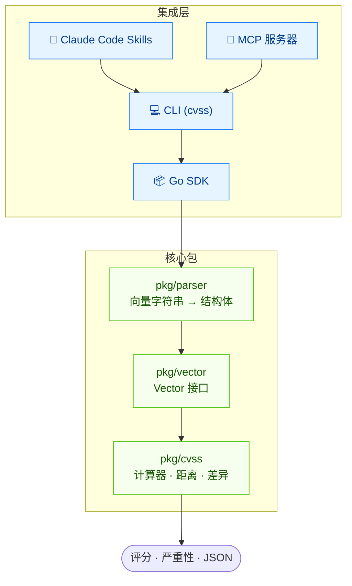
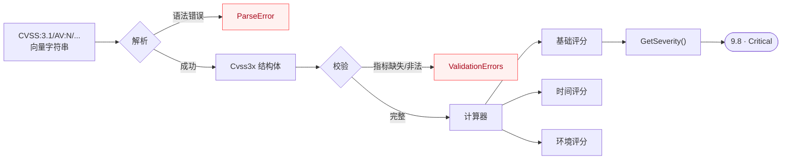
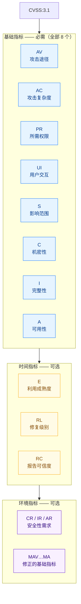
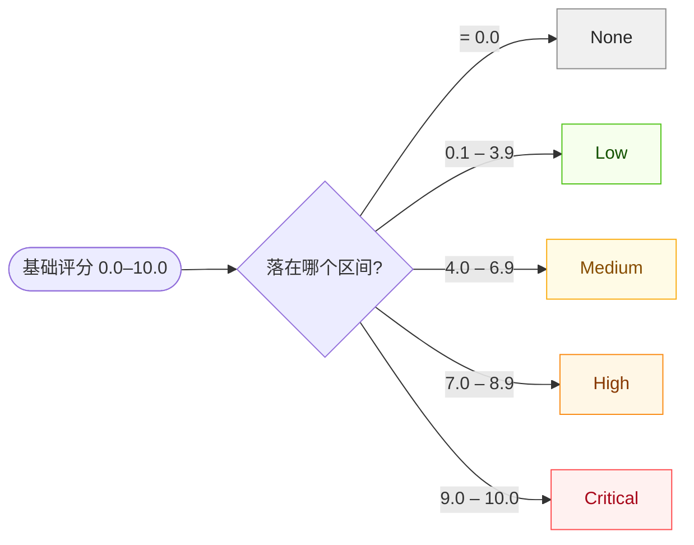

## 解决什么问题？

CVSS 是业界标准的漏洞严重性评级体系，但以编程方式处理向量十分痛苦 —— 解析易错、评分涉及版本特定公式、比较依赖手工、校验零散。

**CVSS Skills** 用一个经过充分测试的工具包解决上述所有问题。


## 架构总览

四种集成方式 —— Skills、Go SDK、CLI、MCP —— 都是同一套经过充分测试的核心包之上的薄封装。模型学一次，处处可用。



## 从向量字符串到评分

标准流水线：原始向量字符串被解析为带类型的结构体，经校验后送入版本感知的计算器，产出评分与严重性等级。



## CVSS 向量结构

一个 CVSS 向量最多由 **3 层**指标构成：




## 严重性等级


| 等级     | 分数范围    | 颜色   |
| -------- | ----------- | ------ |
| None     | 0.0         | 灰色   |
| Low      | 0.1 – 3.9   | 绿色   |
| Medium   | 4.0 – 6.9   | 黄色   |
| High     | 7.0 – 8.9   | 橙色   |
| Critical | 9.0 – 10.0  | 红色   |

数值型基础评分通过 `GetSeverity()` 唯一映射到一个等级区间：



## 快速开始

::: code-group

```bash [Claude Code Skills]
claude mcp add --scope user cvss-skills -- https://github.com/scagogogo/cvss-skills
```

```bash [Go SDK]
go get github.com/scagogogo/cvss-skills@latest
```

```bash [CLI (curl)]
curl -sL https://github.com/scagogogo/cvss-skills/releases/latest/download/cvss-skills_$(uname -s | tr A-Z a-z)_$(uname -m).tar.gz | tar xz
sudo mv cvss /usr/local/bin/
```

```bash [CLI (go install)]
go install github.com/scagogogo/cvss-skills/cmd/cvss-cli@latest
```

:::

```bash
# 对向量评分 —— 每种集成方式效果相同
cvss score "CVSS:3.1/AV:N/AC:L/PR:N/UI:N/S:U/C:H/I:H/A:H"
# 输出: 9.8 (Critical)
```
