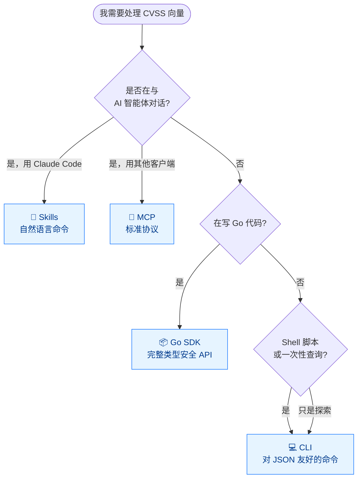
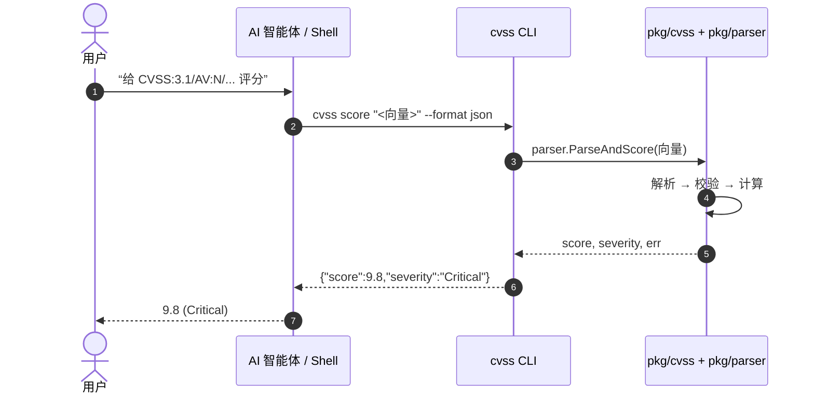

# 集成方式

CVSS Skills 提供 **四种**集成方式，按你的工作流选择。


|          | 集成方式                   | 适用场景                          | 安装                                                                          |
| -------- | -------------------------- | --------------------------------- | ----------------------------------------------------------------------------- |
| 🤖       | **Skills**（Claude Code）  | 交互式分析、自然语言              | `claude mcp add --scope user cvss-skills -- https://github.com/scagogogo/cvss-skills` |
| 📦       | **Go SDK**                 | Go 语言安全工具开发与自动化       | `go get github.com/scagogogo/cvss-skills@latest`                              |
| 💻       | **CLI**                    | 脚本化、批量处理、快速查询        | 见[下载](/zh/downloads/)                                                      |
| 🔌       | **MCP**                    | 通过模型上下文协议集成 AI 智能体   | 从任意兼容 MCP 的客户端将本仓库添加为 MCP 服务器                               |

## 我该用哪种方式？



## 各集成层如何协作

CLI、Skills、MCP 三个层最终都调用同一套 Go 核心，评分逻辑没有任何重复实现：



## 1. Claude Code Skills

一条命令在 Claude Code 中启用 **9 个 CVSS 技能**：

| 技能                | 描述                                |
| ------------------- | ----------------------------------- |
| `/cvss-parse`       | 解析 CVSS v3.0/v3.1 向量字符串      |
| `/cvss-score`       | 计算基础/时间/环境评分              |
| `/cvss-validate`    | 校验向量完整性与正确性              |
| `/cvss-construct`   | 用 Builder API 构建向量             |
| `/cvss-compare`     | Diff、合并与距离计算                |
| `/cvss-metrics`     | 枚举与查看指标定义                  |
| `/cvss-serialize`   | JSON/文本序列化与反序列化           |
| `/cvss-advanced`    | 敏感性分析、分数范围、预设          |
| `/cvss-install`     | 安装 CLI 工具与 Go SDK 依赖         |

::: details 手动安装
添加到项目的 `.claude/settings.json` 或 `~/.claude/settings.json`：

```json
{
  "mcpServers": {
    "cvss-skills": {
      "type": "github",
      "url": "https://github.com/scagogogo/cvss-skills"
    }
  }
}
```

:::

## 2. Go SDK

```go
package main

import (
    "fmt"
    "log"

    "github.com/scagogogo/cvss-skills/pkg/cvss"
    "github.com/scagogogo/cvss-skills/pkg/parser"
)

func main() {
    // 一步解析并评分
    cv, score, severity, err := parser.ParseAndScore(
        "CVSS:3.1/AV:N/AC:L/PR:N/UI:N/S:U/C:H/I:H/A:H",
    )
    if err != nil {
        log.Fatal(err)
    }
    fmt.Printf("Score: %.1f (%s)\n", score, severity) // Score: 9.8 (Critical)
    _ = cv
}
```

完整 API 参考：[API 文档](/docs/zh/api/)。

## 3. CLI

```bash
cvss score "CVSS:3.1/AV:N/AC:L/PR:N/UI:N/S:U/C:H/I:H/A:H"
# 输出: 9.8 (Critical)
```

全部 30+ 命令见 [CLI 参考](/zh/cli/)。

## 4. MCP

从任意兼容 MCP 的客户端（Claude Desktop、Continue、自定义智能体）将本仓库连接为 MCP 服务器，即可通过标准模型上下文协议使用 CVSS 工具。
